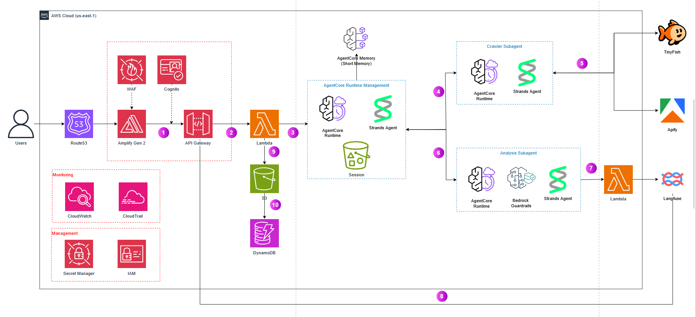

# SignalScout Strategic Change Radar

SignalScout is an OpenAI chat agent that investigates public evidence of corporate restructuring, combining cited replay, metric coverage, readiness gates, and three decision postures: `MAINTAIN`, `ADAPT`, `ACCELERATE`.

The chat flow uses the OpenAI Responses API with a single provider-neutral function tool (`collect_public_evidence`). An application-side Collector Router selects TinyFish or Apify according to policy; the Evidence Gate determines whether a candidate qualifies as approved evidence; Langfuse records traces and evaluation scores. The frozen dashboard runs offline without any provider key.

---

## Architecture Overview

```text
User chat prompt
  → OpenAI Responses API (single tool: collect_public_evidence)
  → Application Collector Router (policy-based provider selection)
      → Approved cache
      → Official structured API (SEC EDGAR)
      → TinyFish Search / Fetch / Agent
      → Apify Actor (batch/recurring)
  → Private raw artifact storage
  → Evidence Gate (fail-closed validation)
  → Curator approval
  → Deterministic metric extraction + pattern engine
  → CasePackage (canonical state)
  → Sanitized public bundle
  → Offline Executive Dashboard
```

### Design Principles

1. **Canonical state rule:** `CasePackage` is the only canonical object. Provider responses, raw fetched text, traces, and receipts are inputs or audit artifacts.
2. **Deterministic authority:** Code — not AI — owns score, stage, readiness, and blocking reasons.
3. **Temporal integrity:** An evidence item is visible only when `publicly_available_at <= as_of`.
4. **Claim integrity:** Every factual claim references one or more approved evidence IDs.
5. **Offline reliability:** Provider failure never breaks the primary dashboard.
6. **Provider neutrality:** The model does not know which provider is selected. The Router decides based on policy.

### Trust Boundaries

| Boundary | Trusted Role | Untrusted Input | Control |
|---|---|---|---|
| Search | URL discovery | Ranking, snippets | Allowlist/denylist, dedupe |
| Fetch | Text retrieval | Remote content | Size limits, no instruction execution |
| Evidence | Historical facts | Unapproved excerpt | Source/evidence IDs, rights, `available_at` |
| Metrics | Structured observations | Ambiguous labels | Deterministic parsing, ambiguity rejection |
| LLM | Narrative draft | Hallucinated facts | JSON schema, tool allowlist, claim validator |
| Bundle | Judged artifact | Secrets, raw pages | Fail-closed public-bundle validator |
| UI | Explanation | Readiness misrepresentation | Render blockers, provenance |

---

## Collector Routing Policy

Policy ID: `COLLECTOR-ROUTER-v1` · Version: `1.0.0`

### Priority Order

```text
1. Approved internal cache
2. Official structured API (SEC EDGAR)
3. TinyFish Search
4. TinyFish Fetch
5. TinyFish Agent
6. Apify Actor
7. Human evidence request
```

This is a decision order, not a requirement to call every preceding tool. A known recurring batch job routes directly to Apify. A known URL routes directly to TinyFish Fetch after cache and official-API checks.

### Routing Decision Table

| Condition | Selected Route | Mode |
|---|---|---|
| An approved cached artifact satisfies the request | Internal cache | `cache_lookup` |
| An official API exposes the required data | Official API | `official_api` |
| SEC filing metadata is required | SEC API | `official_api` |
| Source URL is unknown and live-web discovery is needed | TinyFish Search | `search` |
| 1–10 known public URLs need clean readable content | TinyFish Fetch | `fetch` |
| Site requires adaptive browser interaction | TinyFish Agent | `interactive` |
| More than 10 known URLs share the same extraction schema | Apify Actor | `batch` |
| Collection is recurring or scheduled | Apify Actor | `recurring` |
| A tested Apify Actor already implements the exact extraction | Apify Actor | `actor` |
| No permitted route can obtain adequate evidence | No automatic collection | `human_request` |

### Default Per-Review Budget

```json
{
  "max_official_api_calls": 10,
  "max_tinyfish_search_calls": 2,
  "max_fetch_urls": 10,
  "max_tinyfish_agent_runs": 1,
  "max_apify_runs": 1,
  "max_total_candidates": 20,
  "max_collection_rounds": 2
}
```

The application — not the model — decrements and enforces the budget.

### Non-Negotiable Rules

- Prefer an official structured API over every crawler or browser tool.
- Treat every Apify and TinyFish result as `UNTRUSTED_SOURCE_CANDIDATE`.
- A candidate becomes usable evidence only after the Evidence Gate approves it.
- Never expose API keys, credentials, or private URLs to the model, UI, logs, or stored evidence.
- Stop collection when the evidence request is satisfied or the tool budget is exhausted.
- Do not call a more expensive tool when a cheaper deterministic tool can satisfy the request.

---

## Metric Dictionary

| Group | Metric | Unit | Requirement |
|---|---|---|---|
| Revenue | Revenue / Net Sales | `USD_MILLIONS` | Required |
| Profit | Gross Profit | `USD_MILLIONS` | Required |
| Profit | Operating Income | `USD_MILLIONS` | Required |
| Cost | SG&A | `USD_MILLIONS` | Required |
| Cost | Restructuring Cost | `USD_MILLIONS` | Required |
| Liquidity | Cash and Cash Equivalents | `USD_MILLIONS` | Required |
| Cash flow | Operating Cash Flow | `USD_MILLIONS` | Required |
| Investment | Capital Expenditure | `USD_MILLIONS` | Required |
| Working capital | Inventory | `USD_MILLIONS` | Required |
| Working capital | Accounts Payable | `USD_MILLIONS` | Required |
| Debt | Short-term Debt | `USD_MILLIONS` | Required |
| Debt | Long-term Debt | `USD_MILLIONS` | Required |
| Operations | Store Count | `COUNT` | Required |
| Workforce | Employee Count | `COUNT` | Optional |

Normalize billions to millions deterministically. Do not infer currency or reporting period when the text does not make them explicit.

### Readiness Sections

Each section is `BLOCKED_BY_MISSING_METRICS` when required coverage is missing:

- `RESTRUCTURING_SCENARIOS`
- `COST_BENEFIT_RISK`
- `REVENUE_CASH_FLOW_OPERATING_IMPACT`
- `EXECUTIVE_DASHBOARD`
- `DECISION_REPORT`

---

## Project Structure

```text
backend/
├── src/contracts/       Canonical CasePackage and Zod schemas
├── src/agent/           OpenAI loop, Collector Router, Evidence Gate, audit metrics
├── src/metrics/         Deterministic metric extraction
├── src/report/          Metric coverage and readiness gates
├── src/partners/        URL, SSRF, cost, and payload safety contracts
├── src/server.ts        Chat, metrics, and health HTTP API
├── scripts/             Case builder, bundle validator, partner preflight
└── tests/               Backend unit and adversarial tests

frontend/
├── src/app/             Chatbox, Agent Operations, and Executive Dashboard
├── public/demo/         Frozen validated CasePackage
└── src/app/App.test.tsx Frontend journey and temporal tests

docs/
├── demo/                Demo runbook and task receipts
├── design/              Figma redesign prompt and HTML prototype
├── MVP/                 Dataset research and implementation plan
├── proposal/            Judge-ready master proposal
├── RULES/               Collector routing rules
├── SKILLS/              Partner API guides (Apify, Langfuse, TinyFish)
└── TARGET/              Architecture plans and build guides
```

All commands in this README are run from the repository root.

---

## Requirements

- Node.js 22 or later.
- npm 10 or later.

Verify your environment:

```bash
node --version
npm --version
```

## Installation

```bash
npm install
```

The repository uses npm workspaces. The command above installs dependencies for both `backend` and `frontend`.

---

## Quick Test Flow

Run all automated gates:

```bash
npm test
npm run typecheck
npm run build
npm run validate:public-bundle
```

Expected results:

- Backend: 33 tests pass.
- Frontend: 5 tests pass.
- TypeScript typecheck passes for both workspaces.
- Case bundle is generated at `frontend/public/demo/case-package.json`.
- Validator prints JSON with `"status":"VALID"`.
- Vite production build completes in `frontend/dist/`.

---

## Detailed Test Flow

### 1. Backend Unit Tests

```bash
npm --workspace @SignalScout/backend test
```

Backend tests cover:

- Full metric dictionary extraction preserving `sourceId`/`evidenceId`.
- Normalization of `$7.1 billion` to `7100 USD_MILLIONS`.
- Rejection of financial values missing currency or scale.
- Employee count is optional.
- Two builds from the same input produce identical output.
- Replay does not contain future evidence.
- Validator rejects secrets, dangling references, false readiness, and unsafe URLs.
- Partner safety rejects private IPs, metadata endpoints, IPv6 loopback, and oversized payloads.
- Collector Router selects official API, TinyFish Search/Fetch, or Apify according to policy.
- Evidence Gate keeps candidates pending until curator approval.

Run a single suite:

```bash
npm --workspace @SignalScout/backend exec vitest run tests/metrics/extract-metric-observations.test.ts
npm --workspace @SignalScout/backend exec vitest run tests/scripts/validate-public-bundle.test.ts
```

### 2. Frontend Journey Tests

```bash
npm --workspace @SignalScout/frontend test
```

Frontend tests verify:

- Dashboard successfully loads the frozen bundle.
- Replay, radar, metric lens, scenarios, and executive agenda sections render.
- Future outcomes are not exposed when selecting an earlier replay frame.
- Decision sections are blocked when required metrics are missing.
- Bundle load failure displays recovery instructions.
- Chatbox and Agent Operations metrics/charts render correctly.

### 3. OpenAI Chat and Collector Test Flow

Copy `.env.example` to `.env` and fill in the required variables:

```dotenv
OPENAI_API_KEY=
OPENAI_MODEL=
COLLECTOR_EXECUTION_MODE=validate
TINYFISH_API_KEY=
APIFY_TOKEN=
APIFY_ACTOR_ID=
LANGFUSE_PUBLIC_KEY=
LANGFUSE_SECRET_KEY=
LANGFUSE_BASE_URL=https://cloud.langfuse.com
```

`COLLECTOR_EXECUTION_MODE=validate` is the safe default: OpenAI can request tools, the router still selects a route and writes the audit log, but no paid collector is called.

Start both backend and frontend:

```bash
npm run dev
```

Endpoints:

```text
Frontend:       http://127.0.0.1:5173/
Backend health: http://127.0.0.1:8787/api/health
Agent metrics:  http://127.0.0.1:8787/api/metrics
Chat API:       POST http://127.0.0.1:8787/api/chat
```

Sample chat request:

```json
{
  "sessionId": "demo-session-001",
  "message": "Find public restructuring evidence for Example Retail between January and July 2026"
}
```

UI verification:

1. Send a prompt that does not require web collection and confirm the assistant responds without creating a collector route.
2. Send a discovery prompt and check the Tool execution log.
3. Confirm the model only calls `collect_public_evidence`; the provider is selected in the backend.
4. With a known URL, the route must be `TINYFISH_FETCH`.
5. With batch/recurring or more than 10 URLs, the route must be `APIFY_ASYNC`.
6. Candidates without curator approval must not appear as approved citations.

Focused routing/gate tests:

```bash
npm --workspace @SignalScout/backend exec vitest run tests/agent/router.test.ts
npm --workspace @SignalScout/backend exec vitest run tests/agent/evidence-gate.test.ts
```

### 4. Langfuse Observability

The Evidence Gate runs synchronously in the application and fails closed. Langfuse does not replace the validator; Langfuse receives:

- Trace `SignalScout-chat-turn`.
- OpenAI generation.
- Collector route/tool execution.
- Boolean scores for schema, public URL, replay time, content, rights, and overall gate.
- Token, model, and latency metadata when the provider responds.

When Langfuse is not configured, chat and the Evidence Gate still function. When configured, verify the Langfuse project:

1. A trace exists for every chat turn.
2. The OpenAI call appears within the corresponding trace/session.
3. Evidence Gate scores are attached to the trace.
4. No API key, Authorization header, or full raw page appears in traces.
5. The local dashboard displays run logs, route distribution, validation rate, latency, and token totals.

The core AI also reads the text prompt `SignalScout/chat-agent` with label `production`. Prompt retrieval uses a short timeout, 60-second cache, and the reviewed local developer prompt as fallback. The Operations run log shows `promptSource`, `promptVersion`, and a Langfuse trace link so a prompt rollout can be audited without making Langfuse a runtime dependency.

**Recommended prompt release workflow:**

1. Create a new `SignalScout/chat-agent` version in Langfuse without the `production` label.
2. Run the routing/Evidence Gate dataset and compare scores against the current version.
3. Have a human review tool behavior, citation boundaries, and replay integrity.
4. Move the `production` label only after the eval gate passes.
5. Roll back by moving the label to the previous version; no code deployment is required.

### 5. Typecheck

```bash
npm run typecheck
```

This typechecks backend and frontend sequentially, including contract imports from `@SignalScout/backend/contracts`.

### 6. Generate Frozen Case

```bash
npm run build:case
```

Output:

```text
frontend/public/demo/case-package.json
```

Do not edit this JSON file by hand. Modify fixtures or the builder in the backend, then regenerate.

Verify determinism with PowerShell:

```powershell
npm run build:case
$first = (Get-FileHash frontend\public\demo\case-package.json -Algorithm SHA256).Hash
npm run build:case
$second = (Get-FileHash frontend\public\demo\case-package.json -Algorithm SHA256).Hash
$first -eq $second
```

The result must be `True`.

### 7. Validate Public Bundle

```bash
npm run validate:public-bundle
```

Success output:

```json
{"status":"VALID","caseId":"bbb-retrospective-v1","sources":2,"evidence":4}
```

The validator fails closed on:

- Invalid schema.
- Evidence/source ID that does not exist.
- Metric provenance mismatch.
- Future evidence in a replay frame.
- Claim without approved evidence.
- Section declared `READY` while required metrics are missing.
- Secret or authorization-like content.
- Private/internal source URL.
- Evidence violating rights policy.
- Raw excerpt exceeding the public-safe limit.

Run negative-case tests automatically:

```bash
npm --workspace @SignalScout/backend exec vitest run tests/scripts/validate-public-bundle.test.ts
```

### 8. Partner Validate-Only Preflight

```powershell
$env:PARTNER_EXECUTION_MODE = "validate"
npm run preflight:partners
```

Expected:

```json
{
  "mode": "validate",
  "networkCalls": 0,
  "status": "LOCAL_CONTRACTS_VALIDATED",
  "partners": ["Apify", "Langfuse", "TinyFish"],
  "liveReceipt": false
}
```

This flow only validates request bounds and safety contracts. It makes no API calls, costs no credits, and does not prove live partner usage.

---

## Evidence Gate

Before a candidate is supplied to the Correlator, Challenger, Scenario Composer, pattern scoring, or the public UI, the Evidence Gate verifies:

- Legal entity and CIK.
- Canonical source URL and accession (where applicable).
- Public `available_at` from authoritative metadata.
- `available_at <= replay_as_of`.
- Excerpt-to-observation support.
- Frozen artifact and SHA-256 hash.
- Duplicate source bundle identity.
- Permitted source type and signal taxonomy.
- Rights status for stored and displayed content.
- Absence of later outcome leakage.
- Curator approval.

Approved output contains stable `evidence_id` values. AI factual claims must cite those IDs, not candidate IDs.

---

## Collector Tool Contract

A single provider-neutral tool is exposed to OpenAI:

```json
{
  "name": "collect_public_evidence",
  "description": "Request bounded collection of public evidence candidates. The application selects the provider and enforces policy.",
  "inputSchema": {
    "type": "object",
    "required": ["request_id", "company_identifier", "evidence_question", "source_types", "date_from", "date_to", "replay_as_of", "mode", "max_candidates"],
    "properties": {
      "request_id": { "type": "string" },
      "company_identifier": {
        "type": "object",
        "properties": {
          "legal_name": { "type": "string" },
          "cik": { "type": ["string", "null"] },
          "ticker": { "type": ["string", "null"] }
        }
      },
      "evidence_question": { "type": "string", "minLength": 10, "maxLength": 500 },
      "source_types": {
        "type": "array",
        "items": { "enum": ["SEC_8_K", "SEC_10_Q", "SEC_10_K", "SEC_EXHIBIT", "CORPORATE_RELEASE", "REGULATOR", "COURT", "NEWS_DISCOVERY_ONLY"] }
      },
      "known_urls": { "type": "array", "items": { "type": "string", "format": "uri" }, "maxItems": 1000 },
      "date_from": { "type": "string", "format": "date" },
      "date_to": { "type": "string", "format": "date" },
      "replay_as_of": { "type": "string", "format": "date-time" },
      "mode": { "enum": ["discovery", "fetch_known_urls", "interactive_navigation", "batch", "recurring"] },
      "preferred_domains": { "type": "array", "items": { "type": "string" } },
      "max_candidates": { "type": "integer", "minimum": 1, "maximum": 20 },
      "reason": { "type": "string", "maxLength": 300 }
    }
  }
}
```

The model does not select a provider name. Provider selection belongs to the Collector Router so that routing remains deterministic and can change without modifying model prompts.

---

## Running Locally

Development mode starts both backend and frontend concurrently:

```bash
npm run dev
```

Open:

```text
http://127.0.0.1:5173/
```

Production preview:

```bash
npm run build
npm run preview
```

---

## Manual Dashboard Test Flow

### Replay and Temporal Integrity

1. Open the dashboard and confirm the `Offline replay` label.
2. Select the frame date `Apr 21, 2021`.
3. Confirm the 2023 outcome does not appear in the timeline or pattern radar.
4. Select the frame `Apr 24, 2023`.
5. Confirm the outcome evidence now appears.
6. Open an approved source link and verify it corresponds to the evidence ID.

### Metric Lens

1. Find the metric `Revenue / net sales`.
2. Confirm the displayed value is `7,100 USD millions` with period `FY2020`.
3. Confirm each metric has an evidence link.
4. Confirm status is not conveyed by color alone.

### Decision Journey

1. Verify all three scenarios `MAINTAIN`, `ADAPT`, `ACCELERATE` are present.
2. Verify each scenario has Cost, Benefit, Risk, and impact.
3. Confirm the recommendation is a review posture, not a definitive forecast.
4. Check challenger questions and limitations.
5. Confirm Northstar Home Retail is always marked as fictional.

### Responsive and Accessibility

Test at approximate viewports:

- Mobile: 360 px.
- Tablet: 768 px.
- Desktop: 1280 px and above.

At each viewport:

1. No horizontal overflow outside the metric table container.
2. Long evidence titles wrap normally.
3. Navigation works via `Tab`.
4. Focus indicators are visible.
5. The `As-of date` select, source links, and internal evidence links are keyboard-accessible.

---

## Full Freeze Checklist

Before recording video or submitting:

```bash
npm test
npm run typecheck
npm run build
npm run validate:public-bundle
```

Then verify manually:

- Frozen bundle is deterministic.
- Dashboard runs without any provider key.
- No `.env`, API key, raw page, or receipt exists in public assets.
- Every factual claim has an evidence link.
- Known outcomes do not leak into earlier replay frames.
- Missing metrics are not presented as `READY`.
- Demo rehearsal completes under three minutes twice consecutively.

The full demo script is at `docs/demo/corpwatch-demo-runbook.md`.

---

## Business Invariants

1. **Temporal integrity:** An evidence item is visible only when `publicly_available_at <= as_of`.
2. **Outcome isolation:** The known bankruptcy outcome may appear only after its public date and cannot influence earlier frames.
3. **Claim integrity:** Every factual claim references one or more approved evidence IDs.
4. **Source integrity:** Every evidence/metric source ID exists in the source registry.
5. **Rights integrity:** The public bundle contains only approved excerpts, never a raw page dump.
6. **Deterministic authority:** Code owns score, stage, readiness, and blocking reasons.
7. **Missing-data honesty:** Unavailable metrics produce blockers, not invented values.
8. **Scenario humility:** Cost, benefit, risk, and impact outputs are structured decision support, not certified forecasts.
9. **Replay reproducibility:** Identical frozen input produces identical public JSON.
10. **Offline reliability:** Provider failure never breaks the primary dashboard.

---

## Troubleshooting

### Dashboard reports it cannot load the bundle

```bash
npm run build:case
npm run validate:public-bundle
npm run dev
```

### Port 5173 is in use

```bash
npm --workspace @SignalScout/frontend run dev -- --host 127.0.0.1 --port 5174
```

Then open `http://127.0.0.1:5174/`.

If backend port `8787` is busy, change `BACKEND_PORT` in `.env` and update the proxy target in `frontend/vite.config.ts`.

### Workspace dependencies are not linked

Run from the root:

```bash
npm install
npm run typecheck
```

### Do not claim live partner usage

`preflight:partners` and `COLLECTOR_EXECUTION_MODE=validate` are local validation only. Use the `LIVE_RECEIPT` status only when a real invocation has been made with a sanitized receipt and explicit approval per the instructions in `docs/SKILLS/`.

---

## Related Documentation

| Document | Path |
|---|---|
| Implementation plan (OpenAI chat) | `docs/MVP/signalscout-openai-chat-implementation-plan.md` |
| Ultimate agent build guide | `docs/TARGET/signalscout-ultimate-agent-build-guide.md` |
| Collector routing rules | `docs/RULES/bedrock-collector-routing-rules.md` |
| Judge-ready master proposal | `docs/proposal/signalscout-judge-ready-master-proposal.md` |
| Demo runbook | `docs/demo/corpwatch-demo-runbook.md` |
| Partner API guides | `docs/SKILLS/` |
| Legacy implementation plan (Bedrock/Strands) | `docs/TARGET/signalscout-implementation-plan.md` |
