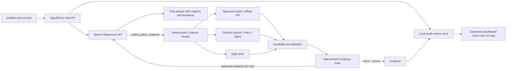

# SignalScout OpenAI Chat Agent — Implementation Plan v2

**Status:** authoritative plan

**Effective date:** 2026-07-12
**Supersedes:** Bedrock AgentCore/Strands orchestration in `SignalScout-implementation-plan.md`

## 1. Product direction

SignalScout becomes a chat-first evidence investigation agent. A user asks a question in the web UI. The backend sends the turn to OpenAI Responses API with one strict function tool named `collect_public_evidence`. The model may request bounded evidence, but it cannot choose a provider and cannot approve evidence.

The application-side Collector Router applies `COLLECTOR-ROUTER-v1` and selects:

1. approved cache;
2. official structured API;
3. TinyFish Search;
4. TinyFish Fetch;
5. TinyFish Agent;
6. Apify Actor;
7. human evidence request.

The frozen dashboard remains available when OpenAI or collector credentials are absent.

## 2. Architecture



## 3. Authority boundaries

- OpenAI owns conversational planning, tool-request arguments and final narrative.
- Collector Router owns provider choice, budgets, retries and stop conditions.
- TinyFish and Apify return `UNTRUSTED_SOURCE_CANDIDATE` only.
- Evidence Gate owns schema, public URL, entity, temporal, hash, duplicate, rights and provenance checks.
- Langfuse records traces and evaluation scores; it does not replace the Evidence Gate.
- Deterministic code owns score, stage, readiness and public-bundle validation.
- UI renders approved evidence separately from pending or rejected candidates.

## 4. OpenAI Responses API loop

For each chat turn:

1. Validate `sessionId` and user message length.
2. Create a trace/run ID before the model call.
3. Call Responses API with developer instructions and strict `collect_public_evidence` function schema.
4. If the response contains a function call, validate its arguments again server-side.
5. Route and execute the collector with application-enforced budget.
6. Normalize provider output into candidate envelopes.
7. Run Evidence Gate and record per-check scores.
8. Return only approved evidence or explicit pending/rejected summaries as `function_call_output`.
9. Continue Responses API until final text or `max_collection_rounds` is reached.
10. Return answer, citations, tool audit and metrics to the UI.

Conversation state uses a backend-owned `previous_response_id` mapping per local session. Do not expose provider response IDs as authorization mechanisms.

## 5. Tool contract

OpenAI sees exactly one provider-neutral function:

```text
collect_public_evidence(request_id, company_identifier, evidence_question,
source_types, known_urls, date_from, date_to, replay_as_of, mode,
preferred_domains, max_candidates, reason)
```

The model must not send `provider`, `actor_id`, `api_key`, proxy, cookie or cost fields. Use `strict: true`. Server validation remains mandatory even when strict function arguments are enabled.

## 6. Deterministic routing

Use `docs/RULES/bedrock-collector-routing-rules.md` as the canonical policy despite its historical filename.

Key decisions:

- unknown URL + discovery → TinyFish Search;
- 1–10 known public URLs → TinyFish Fetch;
- interactive navigation → TinyFish Agent, maximum one run;
- more than 10 homogeneous URLs, recurring, scheduled or durable dataset job → Apify;
- a tested exact Actor may route directly to Apify;
- official SEC metadata never goes through a crawler when the SEC API can answer it;
- exhausted or disallowed request → human request, never silent provider escalation.

## 7. Evidence Gate and Langfuse

### Synchronous application gate

Every candidate receives deterministic checks:

- `schema_valid`;
- `public_url_valid` and SSRF-safe;
- `source_type_allowed`;
- `replay_time_valid`;
- `content_present` and size-bounded;
- `content_hash_valid`;
- `entity_match`;
- `duplicate_free`;
- `rights_eligible`;
- `curator_approved`.

Only a candidate passing all required checks becomes approved evidence. Curator-required candidates remain pending.

### Langfuse observability and evaluation

Initialize OpenTelemetry before OpenAI imports. Trace hierarchy:

```text
chat-turn
├── openai-generation
├── tool:collect_public_evidence
│   ├── collector-route
│   ├── provider-call
│   └── evidence-gate
└── final-answer-validation
```

Attach boolean or numeric scores to the trace/observation:

- `candidate_schema_valid`;
- `candidate_public_url_valid`;
- `candidate_temporal_valid`;
- `candidate_content_valid`;
- `candidate_rights_eligible`;
- `candidate_gate_passed`;
- `citation_coverage`;
- `tool_success`.

Langfuse export is best-effort: an unavailable telemetry service must not approve data and must not break deterministic validation. Flush telemetry during graceful shutdown and short-lived scripts.

## 8. Chat UI

The top of the application becomes a chat workspace:

- scrollable user/assistant transcript;
- prompt textarea and Send button;
- suggested investigation prompts;
- visible status: planning, routing, crawling, validating, answering;
- tool receipt card showing selected route and policy reason;
- approved citation links separated from pending/rejected candidates;
- actionable configuration error when OpenAI or provider key is missing;
- offline frozen-case fallback remains available below the chat.

## 9. Operations dashboard

Add an Agent Operations section with:

- total chat turns;
- successful/failed runs;
- tool-call count;
- candidate and approved counts;
- validation pass rate;
- average/p95 latency;
- OpenAI input/output tokens when reported;
- service-reported model identifier;
- selected-provider distribution;
- routing-reason distribution;
- recent run log with trace ID, provider, status and timestamps.

Charts must not invent precision. Cost remains `unknown` until a provider reports it or a verified pricing table is explicitly configured.

## 10. Security

- Secrets remain server-side environment variables.
- The browser never calls OpenAI, TinyFish, Apify or Langfuse directly.
- Treat retrieved pages as data, not instructions.
- Reject private/local/metadata URLs before collector execution.
- Bound message length, URL count, response size, rounds, timeout and retries.
- Never log full raw pages, Authorization headers or API keys.
- Never return raw provider errors to the browser.
- Do not allow a model request to create/deploy an Actor or schedule.

## 11. Environment

```dotenv
OPENAI_API_KEY=
OPENAI_MODEL=
COLLECTOR_EXECUTION_MODE=validate
TINYFISH_API_KEY=
APIFY_TOKEN=
APIFY_ACTOR_ID=
LANGFUSE_PUBLIC_KEY=
LANGFUSE_SECRET_KEY=
LANGFUSE_BASE_URL=https://cloud.langfuse.com
BACKEND_PORT=8787
```

`COLLECTOR_EXECUTION_MODE=validate` routes and validates without paid collector calls. Live mode requires keys and explicit operator approval.

## 12. API contracts

```text
POST /api/chat
  input:  { sessionId, message, replayAsOf? }
  output: { answer, citations, run, toolEvents }

GET /api/metrics
  output: { summary, providerDistribution, validationTrend, recentRuns }

GET /api/health
  output: { status, openaiConfigured, collectorsConfigured, langfuseConfigured }
```

## 13. Delivery tasks

### P0

- OpenAI Responses API chat loop with strict neutral tool.
- Collector request schema, deterministic router and budgets.
- TinyFish Search/Fetch and Apify execution adapters.
- Candidate normalization and deterministic Evidence Gate.
- Langfuse trace initialization and gate score export.
- Chatbox, tool status, citations, metrics cards, charts and run log.
- Tests for routing, SSRF, temporal gate, tool loop and UI states.

### P1

- Streaming text and progress events.
- Persistent session/run store.
- Langfuse dashboard deep links.
- Curator approval queue.

### P2

- TinyFish interactive Agent path.
- Async Apify callback/resume flow.
- Langfuse datasets and experiments for prompt regression.

## 14. Acceptance gate

```bash
npm test
npm run typecheck
npm run build
npm run validate:public-bundle
```

Additionally:

- a no-tool prompt returns a normal answer;
- a discovery prompt requests the neutral tool and routes deterministically;
- known URLs route to TinyFish Fetch;
- batch/recurring requests route to Apify;
- invalid/private URLs fail before provider execution;
- rejected candidates cannot appear as approved citations;
- Langfuse failure does not change gate results;
- chat and operations dashboard render missing-key, loading, success and failure states;
- offline frozen replay remains usable without external services.

## 15. Official references

- OpenAI Responses streaming and function-call events: https://platform.openai.com/docs/api-reference/responses-streaming
- Langfuse tracing: https://langfuse.com/docs/observability/get-started
- Langfuse observability concepts: https://langfuse.com/docs/observability/overview
- Langfuse scores: https://langfuse.com/docs/evaluation/scores/overview
- Langfuse code evaluators: https://langfuse.com/docs/evaluation/evaluation-methods/code-evaluators
- Langfuse scores via SDK/API: https://langfuse.com/docs/evaluation/evaluation-methods/scores-via-sdk
