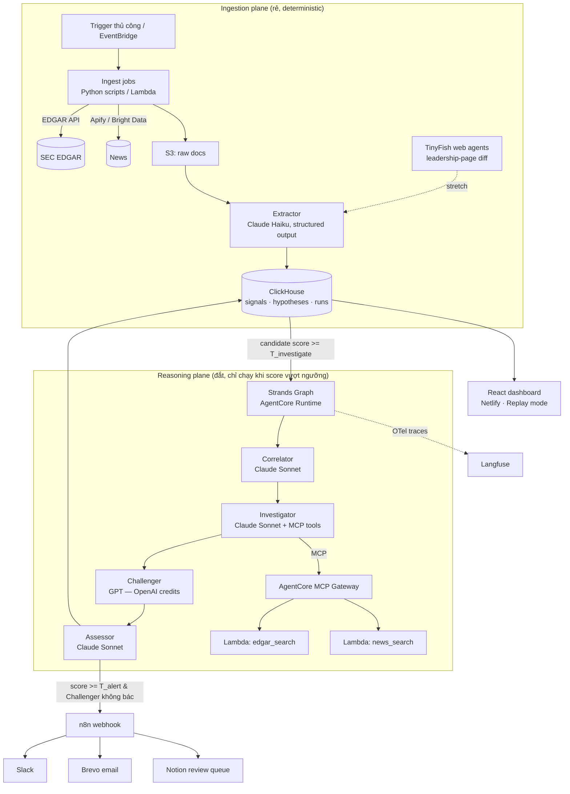

# CorpWatch AI — Kế hoạch triển khai hackathon 4 ngày

> **Mục đích tài liệu:** Spec hoàn chỉnh để đưa vào coding agent (Kiro / Claude Code / TRAE) hoặc chia task cho team. Mọi schema, công thức, contract giữa các module đã được chốt — người code chỉ việc implement theo.
>
> **Stack:** Strands Agents SDK · Amazon Bedrock AgentCore (Runtime + Gateway) · ClickHouse Cloud · React + Netlify · n8n · Langfuse
>
> **Phiên bản:** v1.0 — cập nhật khi có quyết định mới.

---

## 1. Tóm tắt

CorpWatch AI là hệ thống multi-agent phát hiện sớm dấu hiệu **corporate restructuring** bằng cách tương quan hóa (correlate) các weak signals phân tán: layoffs, executive departures, asset sales, hiring freeze, debt events, facility closures, guidance cuts. Một tín hiệu đơn lẻ chưa đáng lo; một **cụm tín hiệu trong cửa sổ thời gian** mới là câu chuyện.

Pipeline: `Ingest → Extract → Correlate → Investigate → Challenge → Assess → Alert`.

**Định nghĩa demo thành công (Definition of Done toàn dự án):**

1. Ingest thật từ EDGAR + news cho watchlist ~8 công ty niêm yết.
2. Strands Graph 4 agent chạy end-to-end, mọi claim trong report có citation trỏ về `signal_id`.
3. **Replay mode**: kéo slider thời gian trên case WeWork/Intel, thấy risk score leo dần, so sánh ngày hệ thống bắn alert với ngày báo chí chính thống gọi tên sự việc.
4. Alert tự động chảy vào Slack + email (Brevo) + Notion review queue qua n8n.
5. (Stretch) TinyFish website-change signal chạy xuyên pipeline; Agora voice briefing đọc daily report (có video backup).

---

## 2. Phạm vi

### 2.1 In-scope

| Hạng mục | Quyết định |
|---|---|
| Đối tượng theo dõi | Công ty niêm yết Mỹ (có SEC filings), watchlist 8 công ty + 2 case backtest |
| Nguồn dữ liệu | EDGAR (8-K, 10-Q/K), news (Apify/Bright Data), TinyFish (stretch) |
| Event taxonomy | 7 loại (mục 4.1) — KHÔNG mở rộng trong 4 ngày |
| Agent framework | Strands Agents SDK, 1 AgentCore Runtime duy nhất, multi-agent bằng `Graph` |
| Signal store | ClickHouse Cloud (kiêm luôn operational store — bỏ DynamoDB) |
| Auth | API key đơn giản (bỏ Cognito full flow) |
| Alert | n8n → Slack + Brevo + Notion |

### 2.2 Out-of-scope (cắt không thương tiếc)

- A2A multi-runtime, Swarm, Step Functions
- AgentCore Memory dài hạn (hypothesis state nằm trong ClickHouse)
- Entity resolution tự động (hardcode mapping tên ↔ ticker cho 10 công ty)
- Private companies, non-US filings
- Scheduler production (bấm nút "Run ingest" thủ công trong demo là chấp nhận được)
- ZenRows, Featherless, Daytona, BytePlus, Tencent, Terminal 3, Virtuals, Instantly

---

## 3. Kiến trúc



**Nguyên tắc 2 mặt phẳng:** ingestion chạy liên tục và rẻ (script + Haiku), reasoning chỉ thức dậy khi correlation score deterministic vượt ngưỡng. Không bao giờ để agent "đọc mọi tin tức".

---

## 4. Data model

### 4.1 Signal schema + event taxonomy

Mọi module giao tiếp qua JSON signal chuẩn:

```json
{
  "signal_id": "uuid",
  "company": "INTC",
  "event_type": "layoff",
  "magnitude": 0.9,
  "direction": "negative",
  "event_date": "2024-08-01",
  "detected_at": "2024-08-01T14:22:00Z",
  "source_type": "sec_8k | news | website_diff",
  "source_url": "https://...",
  "headline": "Intel to cut 15% of workforce",
  "extract_confidence": 0.95,
  "raw_doc_s3": "s3://corpwatch-raw/..."
}
```

**7 event types (KHÔNG thêm loại mới trong 4 ngày):**

| event_type | Định nghĩa | Chuẩn hóa magnitude (0→1) |
|---|---|---|
| `layoff` | Cắt giảm nhân sự | %workforce: <3%→0.3 · 3–8%→0.6 · >8%→0.9; không rõ %→0.5 |
| `exec_departure` | C-suite/board rời đi | CEO/CFO→0.9 · COO/CTO→0.7 · VP/board→0.4 |
| `asset_sale` | Bán tài sản/nhà máy/BU | Có giá trị công bố lớn hoặc BU chiến lược→0.8, còn lại→0.5 |
| `debt_event` | Refinancing, covenant, going-concern, downgrade | going-concern→1.0 · downgrade/covenant→0.8 · refinancing→0.5 |
| `hiring_freeze` | Đóng băng tuyển dụng | Toàn công ty→0.6 · một mảng→0.3 |
| `facility_closure` | Đóng văn phòng/nhà máy/store | Hàng loạt→0.7 · đơn lẻ→0.3 |
| `guidance_cut` | Hạ guidance, ngừng cổ tức, cắt capex | Ngừng cổ tức→0.9 · hạ guidance→0.6 · cắt capex→0.5 |

**Dedup rule:** khóa `hash(company + event_type + event_date ± 2 ngày + registrable_domain(source_url))` — trùng thì giữ bản `extract_confidence` cao hơn.

### 4.2 ClickHouse DDL

```sql
CREATE TABLE signals (
    signal_id UUID,
    company LowCardinality(String),
    event_type LowCardinality(String),
    magnitude Float32,
    direction LowCardinality(String),
    event_date Date,
    detected_at DateTime,
    source_type LowCardinality(String),
    source_url String,
    headline String,
    extract_confidence Float32,
    raw_doc_s3 String,
    dedup_key String
) ENGINE = ReplacingMergeTree(detected_at)
ORDER BY (company, event_date, dedup_key);

CREATE TABLE hypotheses (
    hypothesis_id UUID,
    company LowCardinality(String),
    label String,                    -- vd. "Major Financial Restructuring"
    state LowCardinality(String),    -- open|investigating|strengthened|weakened|alerted|dismissed|expired
    candidate_score Float32,
    final_risk_score Nullable(Float32),
    confidence Nullable(Float32),
    signal_ids Array(UUID),
    challenger_verdict Nullable(String),
    report_json String,
    as_of_date Date,                 -- phục vụ replay mode
    created_at DateTime,
    updated_at DateTime
) ENGINE = ReplacingMergeTree(updated_at)
ORDER BY (company, as_of_date, hypothesis_id);

CREATE TABLE agent_runs (
    run_id UUID,
    hypothesis_id UUID,
    agent LowCardinality(String),
    model LowCardinality(String),
    input_tokens UInt32,
    output_tokens UInt32,
    latency_ms UInt32,
    status LowCardinality(String),
    langfuse_trace_id String,
    created_at DateTime
) ENGINE = MergeTree ORDER BY (created_at);
```

### 4.3 Hypothesis lifecycle

```
open → investigating → strengthened → alerted
                    ↘ weakened   → dismissed
(không có tín hiệu mới 45 ngày) → expired
```

Quy tắc gộp: trước khi tạo hypothesis mới, query hypothesis `state IN (open, investigating, strengthened)` cùng company trong 90 ngày — nếu có thì **append signal_ids** vào hypothesis cũ thay vì tạo mới. Tránh 5 alert trùng cho cùng một sự kiện.

---

## 5. Correlation scoring (deterministic — KHÔNG để LLM tự chấm)

Chạy sau mỗi batch ingest, cho từng company, trên cửa sổ 90 ngày tính đến `as_of_date`:

```
base(c, t) = Σ_over_signals  w(event_type) × magnitude × exp(-Δdays / τ)
score(c, t) = min(1.0, base + synergy_bonus)
```

- `τ = 30` ngày (temporal decay half-life ~21 ngày)
- Mỗi (company, event_type) chỉ tính **1 signal mạnh nhất** trong cửa sổ (chống news trùng thổi phồng score)

**Trọng số w(event_type):**

| event_type | w |
|---|---|
| debt_event | 0.30 |
| exec_departure | 0.25 |
| layoff | 0.22 |
| guidance_cut | 0.20 |
| asset_sale | 0.18 |
| facility_closure | 0.12 |
| hiring_freeze | 0.10 |

**Synergy bonus** (cộng khi cả 2 loại cùng xuất hiện trong cửa sổ):

| Cặp | Bonus |
|---|---|
| layoff + debt_event | +0.15 |
| exec_departure(CFO) + debt_event | +0.15 |
| layoff + exec_departure | +0.10 |
| asset_sale + debt_event | +0.10 |
| ≥4 loại event khác nhau trong 90 ngày | +0.15 |

**Ngưỡng khởi điểm (tune bằng backtest Ngày 3):**

- `T_investigate = 0.55` → kích hoạt Strands Graph
- `T_alert = 0.75` → đủ điều kiện bắn alert (kèm điều kiện Challenger, mục 6)

```python
# scoring/score.py — skeleton
import math
from collections import defaultdict

W = {"debt_event": .30, "exec_departure": .25, "layoff": .22,
     "guidance_cut": .20, "asset_sale": .18, "facility_closure": .12,
     "hiring_freeze": .10}
TAU = 30.0

def candidate_score(signals: list[dict], as_of: "date") -> float:
    best = defaultdict(float)  # event_type -> đóng góp mạnh nhất
    types_present = set()
    for s in signals:
        dd = (as_of - s["event_date"]).days
        if not (0 <= dd <= 90):
            continue
        contrib = W[s["event_type"]] * s["magnitude"] * math.exp(-dd / TAU)
        best[s["event_type"]] = max(best[s["event_type"]], contrib)
        types_present.add(s["event_type"])
    score = sum(best.values())
    if {"layoff", "debt_event"} <= types_present: score += .15
    if {"exec_departure", "debt_event"} <= types_present: score += .15
    if {"layoff", "exec_departure"} <= types_present: score += .10
    if {"asset_sale", "debt_event"} <= types_present: score += .10
    if len(types_present) >= 4: score += .15
    return min(1.0, score)
```

---

## 6. Agents (Strands)

Một AgentCore Runtime, một `Graph` 4 node. Tham chiếu API chính xác tại docs Strands (strandsagents.com) và AgentCore; sketch dưới đây là contract, không phải code final. Lấy **model ID Bedrock chính xác** từ Bedrock console của region bạn deploy (tên model: Claude Haiku cho extraction — nằm ngoài graph; Claude Sonnet cho 3 agent; Challenger dùng GPT qua OpenAI provider của Strands, chạy bằng OpenAI credits).

| Agent | Model | Tools | Input → Output |
|---|---|---|---|
| **Correlator** | Claude Sonnet (Bedrock) | `compute_score` (wrap hàm mục 5), `get_signals` (ClickHouse) | `{company, as_of_date}` → `{hypothesis_label, narrative_vi, missing_evidence: [event_type...], signal_ids}` |
| **Investigator** | Claude Sonnet (Bedrock) | MCP: `edgar_search`, `news_search` · **max 3 vòng lặp** | hypothesis + missing_evidence → `{new_signals: [...], investigation_notes}` (new_signals ghi ngược vào ClickHouse) |
| **Challenger** | GPT (OpenAI provider) | không tool — chỉ nhận evidence pack | toàn bộ signals + narrative → `{verdict: supports\|weakens\|neutral, benign_explanations: [...], strongest_counterargument}` |
| **Assessor** | Claude Sonnet (Bedrock) | không tool | tất cả ở trên → report JSON (schema dưới) |

**Report schema (output cuối):**

```json
{
  "company": "INTC",
  "hypothesis_label": "Major Financial Restructuring",
  "risk_score": 0.82,
  "confidence": 0.7,
  "state": "alerted",
  "summary_vi": "...",
  "timeline": [{"date": "...", "event": "...", "signal_id": "..."}],
  "citations": ["signal_id", "..."],
  "challenger_verdict": "supports",
  "benign_explanations_considered": ["..."],
  "recommended_actions": {
    "procurement": ["..."],
    "sales": ["..."],
    "risk": ["..."]
  }
}
```

**Guardrails bắt buộc (chống hallucination):**

1. Assessor system prompt: *mọi câu khẳng định phải kèm signal_id có trong evidence pack; không có evidence → viết "insufficient evidence", cấm suy diễn.*
2. Alert chỉ bắn khi `risk_score ≥ T_alert` **và** `challenger_verdict != "weakens"`. Nếu weakens → state = `weakened`, vào Notion queue để người review, không bắn Slack/email.
3. Challenger chạy model KHÁC HỌ (GPT) với Correlator/Assessor (Claude) — giảm blind spot tương quan. Đây là điểm kể trong pitch.

**Graph wiring (sketch):**

```python
# agents/graph.py — skeleton, đối chiếu docs Strands cho API chính xác
from strands import Agent, tool
from strands.models import BedrockModel
from strands.models.openai import OpenAIModel
from strands.multiagent import GraphBuilder

sonnet = BedrockModel(model_id="<LẤY TỪ BEDROCK CONSOLE>")
gpt = OpenAIModel(model_id="<GPT model>", client_args={"api_key": OPENAI_API_KEY})

correlator  = Agent(name="correlator",  model=sonnet, tools=[get_signals, compute_score], system_prompt=P_CORRELATOR)
investigator= Agent(name="investigator",model=sonnet, tools=mcp_tools, system_prompt=P_INVESTIGATOR)
challenger  = Agent(name="challenger",  model=gpt,    system_prompt=P_CHALLENGER)
assessor    = Agent(name="assessor",    model=sonnet, system_prompt=P_ASSESSOR)

b = GraphBuilder()
b.add_node(correlator, "correlator"); b.add_node(investigator, "investigator")
b.add_node(challenger, "challenger"); b.add_node(assessor, "assessor")
b.add_edge("correlator", "investigator")
b.add_edge("investigator", "challenger")
b.add_edge("challenger", "assessor")
graph = b.build()

result = graph(json.dumps({"company": "INTC", "as_of_date": "2024-08-05"}))
```

Prompt outline đầy đủ cho 4 agent: xem Phụ lục A.

---

## 7. MCP tools (AgentCore Gateway → Lambda)

| Tool | Input | Output | Backend |
|---|---|---|---|
| `edgar_search` | `{company_or_cik, query, forms?: ["8-K","10-Q"], start_date, end_date, limit<=10}` | `[{filing_url, form, filed_at, snippet}]` | Lambda gọi EDGAR full-text search |
| `news_search` | `{company, query, start_date, end_date, limit<=10}` | `[{url, title, published_at, snippet, domain}]` | Lambda gọi Bright Data SERP (fallback: Apify actor) |

Quy tắc: tool trả **snippet + URL**, KHÔNG trả full text (giữ context gọn). Investigator muốn extract signal mới → gọi Lambda `extract_signals(url)` dùng chung Extractor Haiku với ingestion (một code path duy nhất cho extraction).

---

## 8. Ingestion

### 8.1 EDGAR (nguồn chính — miễn phí, structured, đáng tin)

- Submissions theo công ty: `https://data.sec.gov/submissions/CIK{cik_10_digits}.json`
- Full-text search: `https://efts.sec.gov/LATEST/search-index?q="<cụm từ>"&forms=8-K&startdt=YYYY-MM-DD&enddt=YYYY-MM-DD` *(xác minh tham số chính xác khi code — SEC đổi API thỉnh thoảng)*
- **Bắt buộc** header `User-Agent: corpwatch-hackathon <email>` — thiếu là bị chặn. Rate ~10 req/s.
- **8-K items ưu tiên** (mỏ vàng): `2.05` (exit/disposal costs → layoff, closure), `5.02` (officer departure), `1.01`/`2.03` (material agreements/debt), `2.01` (asset acquisition/disposition), `2.06` (impairments), `8.01` (other events).
- Query cụm từ gợi ý cho full-text: `"reduction in force"`, `"workforce reduction"`, `"restructuring plan"`, `"going concern"`, `"resignation of"`, `"suspend its dividend"`.

### 8.2 News

- **Apify** ($25): actor Google News / news scraper — nhanh nhất ngày đầu. Query template: `"<company name>" (layoffs OR restructuring OR "CFO resigns" OR "sells" OR "hiring freeze" OR "closes")`.
- **Bright Data** ($100): SERP API + Web Unlocker cho bài bị chặn — nguồn chính từ Ngày 2.

### 8.3 Extractor (Haiku, structured output — script thường, KHÔNG phải agent)

Contract: input = raw text/HTML + metadata → output = **JSON array of signals** theo schema 4.1 (có thể rỗng). Prompt yêu cầu: chỉ extract sự kiện thuộc 7 event types, gán magnitude theo bảng chuẩn hóa, `extract_confidence` thấp (<0.6) nếu headline mơ hồ. Loại `extract_confidence < 0.4` trước khi ghi DB.

### 8.4 Watchlist khởi điểm (gợi ý — team chốt Đêm 0)

`INTC, BA, F, PARA, WBD, CVS, NKE, UPS` — đều có hoạt động cắt giảm/tái cấu trúc giai đoạn 2024–2025 nên demo "live" sẽ có tín hiệu thật để xem. Hardcode mapping `{ticker, cik, tên đầy đủ, aliases}` trong `config/watchlist.yaml`.

---

## 9. Backtest cases (seed Ngày 1, chạy Ngày 3)

> ⚠️ Ngày tháng dưới đây là khung sườn từ trí nhớ — **xác minh ngày chính xác từ 8-K/tin gốc khi seed** (mỗi event phải có source_url thật để citation hoạt động).

### Case A — WeWork 2023 (cụm tín hiệu "sách giáo khoa")

| ~Thời điểm | Event | event_type |
|---|---|---|
| 03/2023 | Thỏa thuận tái cấu trúc nợ với SoftBank/bondholders | debt_event |
| 05/2023 | CEO Sandeep Mathrani rời đi | exec_departure |
| 05–06/2023 | CFO rời đi | exec_departure |
| 08/2023 | Cảnh báo "going concern" trong 10-Q | debt_event (mag 1.0) |
| 09–10/2023 | Đàm phán lại/thoát hàng loạt lease | facility_closure |
| 11/2023 | **Chapter 11** ← ground truth | (điểm mốc so sánh) |

**Kỳ vọng:** score vượt `T_alert` quanh 08/2023 (going concern + exec departures) — sớm hơn nhiều tuần so với thời điểm phá sản thành tin trang nhất.

### Case B — Intel 2024

| ~Thời điểm | Event | event_type |
|---|---|---|
| 01/08/2024 | Layoff ~15% (~15k người) | layoff (mag 0.9) |
| 01/08/2024 | Ngừng cổ tức từ Q4 | guidance_cut (mag 0.9) |
| 08/2024 | Cắt capex >$10B kế hoạch 2025 | guidance_cut |
| 09–12/2024 | Tin bán/spin-off tài sản (Altera...) | asset_sale |
| 12/2024 | CEO Gelsinger rời đi | exec_departure (mag 0.9) |

**Kỳ vọng:** alert ngay 08/2024 nhờ synergy layoff + guidance_cut cùng ngày.

**Cách chạy backtest:** seed signals với `event_date` lịch sử → loop `as_of_date` từng ngày qua giai đoạn → ghi `hypotheses(as_of_date, score)` → dashboard Replay đọc bảng này. Lưu `expected_alert_window` mỗi case vào `eval/cases.yaml` làm eval dataset (đẩy lên Langfuse).

---

## 10. Dashboard (React → Netlify)

**Pages:**

1. **Watchlist** — bảng công ty: logo/ngành/headcount (enrich từ Apollo, cache tĩnh vào `config/companies.json` — 1 giờ, đừng làm live), score hiện tại, sparkline 90 ngày, state badge.
2. **Company detail** — timeline signals (dot theo event_type, click mở source_url), hypothesis card: narrative, citations, challenger verdict + benign explanations, recommended actions theo persona.
3. **Replay mode (money shot)** — chọn case (WeWork/Intel) → slider `as_of_date` → line chart score leo dần, đánh dấu 2 mốc: `ngày CorpWatch alert` vs `ngày báo chí chính thống gọi tên` → banner "phát hiện sớm hơn X ngày".

**Data access:** KHÔNG cho browser gọi thẳng ClickHouse. Một FastAPI mỏng (Lambda + Function URL, hoặc chạy trên EC2/local cho hackathon) expose: `GET /companies`, `GET /signals?company&from&to`, `GET /hypotheses?company&as_of`, `POST /run-pipeline?company` (nút demo), `POST /ingest` (nút demo). API key qua header.

**Style:** dark, mật độ thông tin kiểu Bloomberg-lite; ưu tiên rõ ràng > đẹp. Recharts là đủ.

---

## 11. Alerts + Human-in-the-loop (n8n)

**Flow n8n:** `Webhook /alert` ← Assessor (khi đủ điều kiện mục 6) →

1. **Slack** — Block Kit: company, label, score, top-3 evidence (headline + link), nút "Mở dashboard".
2. **Brevo** — transactional email cùng nội dung (template HTML đơn giản).
3. **Notion** — tạo page trong database `CorpWatch Review Queue`.

**Notion DB properties:** `Company (title) · Label (select) · Score (number) · State (select: pending/confirmed/dismissed) · Alert date (date) · Evidence (url list trong body) · Reviewer notes (rich text)`. Analyst confirm/dismiss tại đây — feedback này là data tune trọng số sau hackathon (kể trong pitch, không build UI feedback trong 4 ngày).

Hypothesis `weakened` (Challenger bác) → chỉ vào Notion, không Slack/email.

---

## 12. Stretch features (Ngày 4 — mỗi cái timebox 4 giờ + kill-switch)

### 12.1 TinyFish — website-change monitor (sáng Ngày 4)

- Web agent theo dõi trang **Leadership/About/IR** của 3–5 công ty watchlist; diff → event `{company, page_url, change_summary}` → đẩy qua Extractor như một `source_type: website_diff`.
- **Rủi ro demo:** trang thật có thể không đổi gì trong ngày pitch → chuẩn bị sẵn 1 diff event mẫu (executive bị xóa khỏi trang leadership) chạy xuyên pipeline, nói thẳng "đây là dạng tín hiệu TinyFish bắt được".
- **Kill-switch:** 12h trưa Ngày 4 chưa có diff event chạy xuyên pipeline → cắt, chỉ giữ slide mô tả.

### 12.2 Agora ConvoAI — voice briefing (chiều Ngày 4)

- Flow gọn nhất: Assessor đã lưu `daily_briefing_text` → Agora ConvoAI agent **đọc và trả lời câu hỏi chỉ dựa trên đúng text đó** (system prompt cấm gọi tool/suy diễn ngoài text).
- Closer của pitch: "gọi điện cho risk analyst AI của bạn mỗi sáng".
- **Bắt buộc:** quay video backup ngay lần chạy thành công đầu tiên. Không demo live real-time mà không có video dự phòng.
- **Kill-switch:** 18h Ngày 4 chưa chạy → dùng video hoặc cắt hẳn.

---

## 13. Observability (Langfuse — bật từ Ngày 1)

- Strands xuất OpenTelemetry → cấu hình OTLP endpoint + auth của Langfuse qua env (`OTEL_EXPORTER_OTLP_ENDPOINT`, `OTEL_EXPORTER_OTLP_HEADERS` — xem docs Langfuse mục OpenTelemetry).
- Trace naming: `pipeline/{company}/{as_of_date}`, span mỗi agent; ghi `langfuse_trace_id` vào `agent_runs` để dashboard link sang trace.
- Theo dõi: cost per hypothesis, latency per agent, tỉ lệ Challenger bác.
- Eval: upload `eval/cases.yaml` (expected_alert_window) làm dataset — chấm pass/fail sau mỗi lần đổi trọng số.

---

## 14. Hạ tầng & cấu hình

**AWS resources checklist:** 1 AgentCore Runtime (graph) · AgentCore Gateway + 3 Lambda tools (`edgar_search`, `news_search`, `extract_signals`) · S3 bucket `corpwatch-raw` · Lambda/FastAPI cho dashboard API · (tùy chọn cuối) EventBridge rule gọi ingest 2h/lần. Bedrock: bật model access cho Claude Sonnet + Haiku trong region deploy.

**Secrets:** hackathon dùng `.env` + AWS Secrets Manager cho phần chạy trên AWS. `.env` vào `.gitignore` NGAY commit đầu.

```
# .env.example
AWS_REGION=
BEDROCK_MODEL_SONNET=        # lấy từ Bedrock console
BEDROCK_MODEL_HAIKU=
OPENAI_API_KEY=              # Challenger
CLICKHOUSE_HOST= / CLICKHOUSE_PASSWORD=
BRIGHTDATA_API_KEY=
APIFY_TOKEN=
SEC_USER_AGENT="corpwatch-hackathon your-email@x.com"
LANGFUSE_PUBLIC_KEY= / LANGFUSE_SECRET_KEY= / LANGFUSE_HOST=
N8N_ALERT_WEBHOOK_URL=
NOTION_TOKEN= / NOTION_DB_ID=
BREVO_API_KEY=
DASHBOARD_API_KEY=
TINYFISH_API_KEY=            # stretch
AGORA_APP_ID= / AGORA_...    # stretch
```

---

## 15. Repo structure

```
corpwatch/
├── config/
│   ├── watchlist.yaml          # ticker, cik, aliases (hardcode)
│   ├── weights.yaml            # w(event_type), synergy, τ, thresholds
│   └── companies.json          # Apollo enrichment cache
├── ingestion/
│   ├── edgar.py                # submissions + full-text
│   ├── news_apify.py / news_brightdata.py
│   ├── extractor.py            # Haiku structured output (code path duy nhất)
│   └── run_ingest.py           # CLI: --company --from --to
├── scoring/
│   └── score.py                # mục 5
├── agents/
│   ├── prompts/                # 4 file .md (Phụ lục A)
│   ├── tools_local.py          # get_signals, compute_score
│   ├── graph.py                # Strands Graph
│   └── deploy_agentcore.py
├── mcp_lambdas/
│   ├── edgar_search/ · news_search/ · extract_signals/
├── api/
│   └── main.py                 # FastAPI cho dashboard
├── dashboard/                  # React (Vite) → Netlify
├── backtest/
│   ├── seed_wework.py · seed_intel.py
│   └── replay.py               # loop as_of_date
├── eval/cases.yaml
├── db/schema.sql               # mục 4.2
└── .env.example
```

---

## 16. Lịch 4 ngày — checklist

### Đêm 0 (chuẩn bị, ~2h)
- [ ] Redeem perks: AWS, Bright Data, ClickHouse, Netlify, Langfuse, Apollo, Brevo, n8n, Apify, TinyFish, OpenAI, Agora
- [ ] Chốt watchlist 8 công ty + phân công: **Dev A** = data/scoring, **Dev B** = agents/infra, **Dev C** = dashboard/alerts (1 người kiêm nhiều vai nếu team nhỏ)
- [ ] Tạo repo theo mục 15, commit `schema.sql`, `weights.yaml`, `.env.example`

### Ngày 1 — Data pipeline (KHÔNG agent nào)
- [ ] ClickHouse: tạo service, chạy DDL
- [ ] `edgar.py` chạy được cho 1 công ty (8-K items ưu tiên) → S3
- [ ] `extractor.py` Haiku → signals vào ClickHouse (kèm dedup)
- [ ] News qua Apify cho watchlist 30 ngày gần nhất
- [ ] Seed 2 backtest cases (đã verify ngày + source_url)
- [ ] `score.py` + unit test trên data WeWork (score 08/2023 phải > 0.75)
- [ ] Langfuse nhận trace đầu tiên
- **DoD Ngày 1:** `SELECT count(*) FROM signals` > 100; score WeWork tại 15/08/2023 ≥ T_alert

### Ngày 2 — Multi-agent core
- [ ] 2 MCP Lambda + AgentCore Gateway
- [ ] 4 agent + prompts, Graph wiring, deploy AgentCore Runtime
- [ ] Guardrail citation + điều kiện Challenger hoạt động
- [ ] Chạy end-to-end cho Intel 05/08/2024 → report JSON hợp lệ, mọi claim có signal_id
- **DoD Ngày 2:** 1 lệnh `POST /run-pipeline?company=INTC&as_of=2024-08-05` trả report đầy đủ; trace 4 agent hiện trên Langfuse

### Ngày 3 — Dashboard + Backtest + Alerts
- [ ] FastAPI endpoints; React 3 pages lên Netlify
- [ ] `replay.py` chạy 2 cases → bảng hypotheses theo as_of_date
- [ ] Replay mode với slider + banner "sớm hơn X ngày"
- [ ] n8n flow Slack + Brevo + Notion; test alert thật
- [ ] Tune trọng số nếu backtest lệch (chỉ sửa `weights.yaml`)
- **DoD Ngày 3:** demo được 3 phút liền mạch không sờ terminal (trừ nút bấm trên dashboard)

### Ngày 4 — Stretch + polish + pitch
- [ ] Sáng: TinyFish (kill-switch 12h)
- [ ] Chiều: Agora voice (kill-switch 18h, video backup bắt buộc)
- [ ] Chạy demo thử 3 lần, quay video full-run dự phòng
- [ ] Slide pitch + dry-run

---

## 17. Kịch bản demo 3 phút

1. **(30s) Vấn đề:** "Ngày 1 chỉ là một tin layoff — chưa ai lo. Ngày 12, CFO nghỉ. Ngày 20, bán nhà máy. Từng tín hiệu đều vô hại; cụm tín hiệu là câu chuyện. Analyst không thể canh 100 công ty."
2. **(60s) Replay WeWork:** kéo slider — score leo dần, mốc alert của CorpWatch vs mốc báo chí. "Sớm hơn X ngày."
3. **(60s) Live pipeline:** bấm Run cho 1 công ty watchlist → mở Langfuse trace: Correlator đặt giả thuyết → Investigator tự đi tìm bằng chứng thiếu trên EDGAR → **Challenger (GPT) phản biện Claude** → Assessor ra report có citation từng dòng. Alert nổ trên Slack + Notion ngay trên màn hình.
4. **(30s) Closer:** cuộc gọi voice briefing Agora (hoặc video) + "mọi kết luận đều truy vết được về filing gốc — đây là hệ thống analyst dám tin."

---

## 18. Rủi ro & dự phòng

| Rủi ro | Dự phòng |
|---|---|
| EDGAR rate-limit / đổi API | Cache toàn bộ raw vào S3 từ Ngày 1; demo chạy trên data đã cache |
| Bright Data/Apify trả rác | Extractor lọc `confidence < 0.4`; luôn có EDGAR làm nguồn sạch |
| AgentCore deploy trục trặc | Fallback: chạy Strands Graph trong 1 Lambda/container thường — giám khảo quan tâm hành vi agent hơn chỗ host |
| Backtest không vượt ngưỡng đúng lúc | Chỉ tune `weights.yaml`, không sửa code; unit test Ngày 1 để phát hiện sớm |
| Challenger bác nhầm case demo | Ghi cả 2 nhánh; nếu weakens → demo chính nhánh Notion review (biến thành feature "hệ thống thận trọng") |
| Live demo sập mạng/API | Video full-run quay Ngày 4 + toàn bộ chạy được trên data cache |

---

## 19. Perk mapping (điền vào slide "sponsor usage")

| Perk | Vai trò trong CorpWatch |
|---|---|
| AWS $1,000 | Bedrock (Claude) · AgentCore Runtime/Gateway · Lambda · S3 |
| OpenAI $150 | Challenger agent (cross-model adversarial) + LLM-as-judge backtest |
| Bright Data $100 | News/SERP + Web Unlocker (nguồn chính từ Ngày 2) |
| Apify $25 | News actors — data ngay Ngày 1 |
| ClickHouse $300 | Signal store + backtest engine + dashboard queries |
| Langfuse | Tracing 4 agent, cost, eval dataset |
| Netlify | Host dashboard |
| n8n | Alert routing Slack/Brevo/Notion |
| Brevo | Email alert/digest |
| Notion | Human review queue |
| Apollo | Company enrichment (logo/ngành/headcount) |
| TinyFish | Website-change signals (stretch) |
| Agora | Voice briefing (stretch) |
| Kiro/TRAE/Qoder | Công cụ build |

---

## Phụ lục A — Prompt outlines (viết đầy đủ trong `agents/prompts/`)

**P_CORRELATOR:** Vai trò analyst tương quan tín hiệu. Nhận `{company, as_of_date}`. BẮT BUỘC gọi `get_signals` rồi `compute_score` (không tự chấm điểm). Nhiệm vụ: đặt tên hypothesis (chọn 1: Major Financial Restructuring / Strategic Pivot / Distress–M&A target / Cost Optimization / No significant pattern), viết narrative ≤150 từ tiếng Việt chỉ dựa trên signals, liệt kê `missing_evidence` = các event_type sẽ củng cố/bác giả thuyết mà chưa có. Output JSON đúng schema, không thêm chữ ngoài JSON.

**P_INVESTIGATOR:** Nhận hypothesis + missing_evidence. Tối đa 3 lượt tool. Ưu tiên `edgar_search` (đáng tin) trước `news_search`. Chỉ báo cáo những gì tìm thấy kèm URL; không tìm thấy → ghi rõ "not found". Với mỗi finding, gọi `extract_signals(url)` để chuẩn hóa. Output: `{new_signals, investigation_notes}`.

**P_CHALLENGER (chạy trên GPT):** Vai trò devil's advocate. Nhận evidence pack + narrative. Nhiệm vụ: tìm cách giải thích LÀNH TÍNH cho từng tín hiệu (vd. layoff hậu M&A theo kế hoạch; CEO nghỉ đã announce trước; bán tài sản nằm trong chiến lược công bố từ lâu), chỉ ra bằng chứng yếu/nguồn kém tin cậy, đưa `strongest_counterargument`. Kết luận verdict: `supports` (không tìm được giải thích lành tính thuyết phục) / `weakens` (có) / `neutral`. Không được bịa fact mới — chỉ lập luận trên evidence đã cho.

**P_ASSESSOR:** Tổng hợp tất cả. Quy tắc sắt: mỗi câu khẳng định phải kèm `[signal_id]` tồn tại trong evidence pack; thiếu evidence → viết "insufficient evidence"; cấm suy diễn ngoài dữ liệu. Điều chỉnh `confidence` giảm nếu challenger_verdict = neutral/weakens. Sinh `recommended_actions` theo 3 persona (procurement / sales / risk), mỗi persona ≤3 hành động cụ thể. Output đúng report schema mục 6.

---

*Hết. Mọi thay đổi trọng số/ngưỡng chỉ sửa `config/weights.yaml`; mọi thay đổi taxonomy phải cập nhật đồng thời: schema 4.1, Extractor prompt, bảng w, và tài liệu này.*
