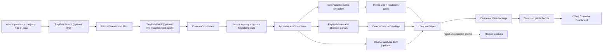

# SignalScout Strategic Change Radar — Ultimate Agent Build Guide

> **For agentic workers:** REQUIRED SUB-SKILL: Use `superpowers:subagent-driven-development` (recommended) or `superpowers:executing-plans` to implement this plan task-by-task. Every production-code change must follow `superpowers:test-driven-development`. If a test or runtime behavior is unexpected, stop and use `superpowers:systematic-debugging` before editing further.

**Goal:** Build and freeze a reliable local MVP that turns cited public evidence about corporate restructuring into a replayable strategic-change story, deterministic metric coverage, decision scenarios, and an executive review agenda.

**Architecture:** A frozen `CasePackage` is the canonical state and powers the judged offline experience. TinyFish and OpenAI are optional, bounded adapters that may create candidate data and analysis drafts, but deterministic validation, evidence linkage, readiness gates, and public-bundle sanitation remain local and fail closed.

**Tech Stack:** TypeScript, React, Vite, Vitest, Zod, OpenAI Responses API adapter, TinyFish Search/Fetch adapter, static JSON replay bundle.

## Global Constraints

- Team: 6 people.
- Build window: 1 day, approximately 10 working hours.
- Main public case: retrospective Bed Bath & Beyond evidence.
- Fictional comparison company: Northstar Home Retail.
- Primary judged path: local/offline replay plus prerecorded video.
- OpenAI live-call budget: maximum USD 6 and only with explicit approval configuration.
- `.env.local` is secret, ignored by Git, and must never be copied into logs, screenshots, bundles, or commits.
- No model, provider, package, endpoint, or partner-usage claim may be made from memory; verify against current official documentation and save a receipt for every partner claimed on Devpost.
- Never call the product a bankruptcy predictor or treat a score as a calibrated probability.
- Never let AI mutate deterministic scores, stages, evidence visibility, or readiness gates.
- Never require a live partner service for the judged experience.
- Do not reset, clean, or rewrite the current worktree; it contains important tracked and untracked artifacts.
- Use the existing contracts and Zod schemas. Inspect them before edits; do not create competing shapes.

---

## 1. How a Completely New Agent Must Use This File

1. Read this file fully.
2. Read, in order:
   - `docs/ai/SignalScout-next-agent-implementation-plan.md`
   - `docs/methodology/SignalScout-methodology-v1.md`
   - `docs/methodology/strategic-metric-lens.md`
   - `docs/methodology/tinyfish-search-fetch-pipeline.md`
   - `docs/proposal/SignalScout-judge-ready-master-proposal.md`
3. Inspect `package.json`, `src/contracts/`, and the exact source/test files named by the task being executed.
4. Run the baseline commands before changing anything.
5. Execute tasks in dependency order. Do not begin UI polish before the frozen case bundle and bundle validator work.
6. Update the checkboxes in this file after each independently verified task.
7. Preserve receipts under a sanitized artifact location, never inside the public application bundle.

If an older document conflicts with this guide, use this precedence:

1. Current source code and passing tests.
2. Current contracts and methodology gates.
3. This guide.
4. `SignalScout-next-agent-implementation-plan.md`.
5. Older handoff/proposal language.

Known stale statement: `SignalScout-complete-agent-handoff.md` says implementation had not started. That statement is obsolete; OpenAI, TinyFish, metric-lens, analysis-input, review-agenda, and initial dashboard work now exist.

---

## 2. Product Truth in One Page

### 2.1 Problem

Corporate change signals are fragmented across filings, financial disclosures, store actions, workforce changes, financing events, leadership moves, and news. A strategy or competitive-intelligence team needs a cited, time-ordered explanation of what changed and what response should be reviewed—not another opaque prediction.

### 2.2 User

Primary user: a strategy, competitive-intelligence, enterprise-risk, procurement, supplier-risk, or commercial-exposure analyst preparing an executive decision review.

### 2.3 Job to be done

> “When a watched company begins restructuring, show me the evidence cluster, the financial and operating metrics affected, the plausible response scenarios, and what leadership should review next.”

### 2.4 Core decision

The executive chooses one posture:

- `MAINTAIN`: monitor and preserve the current plan.
- `ADAPT`: make bounded changes to pricing, inventory, channels, footprint, supplier exposure, or operating model.
- `ACCELERATE`: act aggressively while the competitor is distracted or structurally weakened.

These are review postures, not autonomous decisions.

### 2.5 Main outputs

1. Evidence replay timeline.
2. Strategic pattern radar.
3. Metric coverage and missing-data warnings.
4. Restructuring scenarios.
5. Cost-benefit-risk comparison.
6. Revenue, cash-flow, and operating-impact framing.
7. Executive Dashboard.
8. Decision recommendation and challenge questions.

### 2.6 Differentiator

Every factual claim is traceable to approved evidence; every replay view obeys time visibility; every decision section declares whether it is ready or blocked by missing metrics. The AI drafts explanations. Deterministic code decides whether those explanations are admissible.

---

## 3. MVP Scope and Non-Goals

### 3.1 Must ship

- One frozen, rights-safe Bed Bath & Beyond retrospective case.
- One fictional Northstar Home Retail comparison context.
- Offline application loads without partner APIs.
- Evidence items retain source and evidence identifiers.
- Replay does not expose evidence before `publicly_available_at <= as_of`.
- Deterministic metric extraction covers the required metric dictionary.
- Metric lens visibly blocks unsupported decision sections.
- Public case builder emits a stable JSON bundle.
- Public-bundle validator fails on secrets, raw-text leakage, broken references, or false readiness.
- Dashboard tells a coherent 3-minute judge story.
- Optional OpenAI/TinyFish live path has an explicit enable switch, allowlisted tools, small bounded calls, and graceful fallback.

### 3.2 Explicitly out of scope

- Generalized multi-company production monitoring.
- Real-time alerts, queues, schedulers, or exactly-once ingestion.
- Calibrated bankruptcy or revenue forecasting.
- Autonomous restructuring recommendations.
- Training or fine-tuning a model.
- Full authentication, multi-tenancy, billing, or production deployment hardening.
- A vector database unless a measured MVP requirement proves it necessary.
- Adding AWS Bedrock, Apify, ClickHouse, or Langfuse merely to list more partners.

---

## 4. System Architecture



### 4.1 Trust boundaries

| Boundary | Trusted role | Untrusted or non-canonical input | Required control |
|---|---|---|---|
| Search | URL discovery | Ranking, snippets, unknown sites | Allowlist/denylist, dedupe, source registration |
| Fetch | Text retrieval | Remote content, prompt injection, malformed pages | Size limits, content-type checks, no instruction execution |
| Evidence | Historical facts | Unapproved excerpt or unverifiable timestamp | Source/evidence IDs, rights status, `publicly_available_at` |
| Metrics | Structured observations | Ambiguous labels, mixed periods/units | Deterministic parsing, normalization, ambiguity rejection |
| LLM | Narrative draft | Hallucinated facts, tool arguments, overconfident recommendations | JSON schema, tool allowlist, claim/evidence validator |
| Bundle | Judged artifact | Secrets, raw pages, internal receipts | Fail-closed public-bundle validator |
| UI | Explanation | Readiness misrepresentation | Render blockers and provenance explicitly |

### 4.2 Canonical state rule

`CasePackage` is the only canonical object. Provider responses, raw fetched text, traces, and receipts are inputs or audit artifacts. The UI must never read provider output directly.

---

## 5. Business and Evidence Invariants

1. **Temporal integrity:** an evidence item is visible only when `publicly_available_at <= as_of`.
2. **Outcome isolation:** the known bankruptcy outcome may appear only after its public date and cannot influence earlier frames.
3. **Claim integrity:** every factual claim references one or more approved evidence IDs.
4. **Source integrity:** every evidence/metric source ID exists in the source registry.
5. **Rights integrity:** the public bundle contains only approved excerpts and metadata, never an unrestricted page dump.
6. **Deterministic authority:** code—not AI—owns score, stage, readiness, and blocking reasons.
7. **Missing-data honesty:** unavailable metrics produce blockers, not invented values.
8. **Scenario humility:** cost, benefit, risk, and impact outputs are structured decision support, not certified forecasts.
9. **Replay reproducibility:** identical frozen input produces identical public JSON.
10. **Offline reliability:** provider failure never breaks the primary dashboard.

---

## 6. Metric Dictionary and Decision Gates

### 6.1 Metrics

| Group | Metric key | Normalized unit | Requirement |
|---|---|---:|---|
| Revenue | Revenue / Net Sales | `USD_MILLIONS` | Required |
| Profit | Gross Profit | `USD_MILLIONS` | Required |
| Profit | Operating Income | `USD_MILLIONS` | Required |
| Cost | SG&A | `USD_MILLIONS` | Required |
| Cost | Restructuring Cost | `USD_MILLIONS` | Required |
| Liquidity | Cash and Cash Equivalents | `USD_MILLIONS` | Required |
| Cash flow | Operating Cash Flow | `USD_MILLIONS` | Required |
| Investment | Capital Expenditure | `USD_MILLIONS` | Required |
| Working capital | Inventory | `USD_MILLIONS` | Required |
| Working capital | Accounts Payable | `USD_MILLIONS` | Required |
| Debt | Short-term Debt | `USD_MILLIONS` | Required |
| Debt | Long-term Debt | `USD_MILLIONS` | Required |
| Operations | Store Count | `COUNT` | Required |
| Workforce | Employee Count | `COUNT` | Optional |

Normalize billions to millions deterministically. Do not infer currency or reporting period when the text does not make them explicit. `REPORTED` quality means directly stated in approved text; calculated values need a distinct derivation basis supported by the existing contract.

### 6.2 Readiness sections

- `RESTRUCTURING_SCENARIOS`
- `COST_BENEFIT_RISK`
- `REVENUE_CASH_FLOW_OPERATING_IMPACT`
- `EXECUTIVE_DASHBOARD`
- `DECISION_REPORT`

Missing required coverage must yield `BLOCKED_BY_MISSING_METRICS` for the affected section. The UI must display the blocker and the missing metrics.

---

## 7. Repository Map

### 7.1 Existing implementation to preserve

| Path | Responsibility |
|---|---|
| `src/contracts/` | Canonical case/watch/evidence contracts and schemas |
| `src/partners/openai.ts` | Responses API adapter, structured analysis, approval gate, tool loop |
| `src/partners/tinyfish.ts` | Search/Fetch client, tool definitions, allowlisted executors |
| `src/report/build-metric-lens.ts` | Metric coverage and section-readiness gates |
| `src/analysis/build-analysis-input.ts` | Validated provider input including metric lens |
| `src/analysis/validate-analysis.ts` | Analysis/claim validation |
| `src/report/build-review-agenda.ts` | Executive review agenda generation |
| `src/app/App.tsx` | Current dashboard shell and metric table |
| `scripts/preflight-openai.ts` | Validate/live OpenAI preflight; optionally exposes TinyFish tools |
| `scripts/build-case.ts` | Present but must be completed as deterministic case builder |
| `scripts/validate-public-bundle.ts` | Present but must be completed as fail-closed validator |
| `tests/partners/openai.test.ts` | OpenAI adapter tests |
| `tests/partners/tinyfish.test.ts` | TinyFish adapter tests |
| `tests/report/build-metric-lens.test.ts` | Metric-lens tests |

### 7.2 Files this plan expects to add or complete

| Path | Single responsibility |
|---|---|
| `src/metrics/extract-metric-observations.ts` | Deterministically extract normalized metric observations from approved text |
| `tests/metrics/extract-metric-observations.test.ts` | Extraction, normalization, ambiguity, provenance, and leakage tests |
| `tests/fixtures/metric-text.ts` | Minimal rights-safe synthetic disclosure snippets |
| `tests/scripts/build-case.test.ts` | Deterministic bundle-builder contract tests |
| `tests/scripts/validate-public-bundle.test.ts` | Secret/leak/reference/readiness rejection tests |
| `public/demo/case-package.json` | Generated judged replay bundle; never hand-edited |
| `scripts/preflight-tinyfish.ts` | Optional bounded TinyFish search/fetch proof |
| `tests/partners/tinyfish-preflight.test.ts` | Sanitization and bound tests for live proof path |
| `.artifacts/partner-receipts/` | Local sanitized proof, excluded from public bundle and Git unless explicitly reviewed |

Before creating any listed file, verify that an equivalent does not already exist under a different path.

---

## 8. Environment and Safe Execution

Expected local variables:

```env
OPENAI_API_KEY=
OPENAI_MODEL=
PARTNER_EXECUTION_MODE=validate
OPENAI_ENABLE_TINYFISH_TOOLS=false
OPENAI_LIVE_APPROVAL_JSON={"approved":true,"approver":"minhquan","approvedAt":"2026-07-11T00:00:00.000Z","purpose":"SignalScout MVP OpenAI live preflight","maxCostUsd":6}
TINYFISH_API_KEY=
```

Rules:

- Read values from `.env.local`; do not print the file.
- Default to `PARTNER_EXECUTION_MODE=validate`.
- A live OpenAI call requires valid approval JSON and `maxCostUsd <= 6`.
- TinyFish tools remain disabled unless its key exists and the explicit flag is `true`.
- Save only status, timing, request purpose, provider, model returned by the service, tool names, URL domains, response IDs, and sanitized error summaries in receipts.
- Never save authorization headers, full fetched pages, full prompts containing proprietary text, or raw provider responses to public assets.

Baseline:

```bash
npm install
npm test
npm run typecheck
npm run build
```

Expected baseline: all commands exit `0`. If not, use systematic debugging and establish whether the failure predates the task before editing.

---

## 9. One-Day Team Operating Model

| Person | Primary ownership | Merge dependency |
|---|---|---|
| 1 — Tech lead | Contracts, integration order, final freeze | Approves schema and scope changes |
| 2 — Evidence/data | Case evidence, source registry, metric fixtures | Supplies approved IDs/text |
| 3 — Deterministic pipeline | Metric extractor and case builder | Produces frozen JSON |
| 4 — Validation/security | Public-bundle validator, negative tests | Gates dashboard artifact |
| 5 — Frontend/demo | Dashboard, responsiveness, accessibility, video flow | Consumes frozen JSON only |
| 6 — AI/partners/submission | OpenAI/TinyFish proof, receipts, Devpost wording | Claims only receipt-backed usage |

Synchronization checkpoints:

- Hour 1: baseline green; contracts and evidence set frozen.
- Hour 3: metric extraction green.
- Hour 5: deterministic public case emitted and validated.
- Hour 7: dashboard complete against frozen JSON.
- Hour 8: partner proof attempted; failures do not change judged path.
- Hour 9: video rehearsal and submission truth audit.
- Hour 10: code freeze; only blocker fixes.

---

## 10. Implementation Plan

### Task 0: Establish a Verified Baseline

**Files:**
- Inspect: `package.json`
- Inspect: `src/contracts/`
- Inspect: `.gitignore`
- Update only if observed state differs: this guide's “Current State Ledger” section

**Interfaces:**
- Consumes: current repository and local Node environment.
- Produces: a recorded baseline result and confirmed script names; no production diff.

- [ ] **Step 1: Confirm OS and runtime**

Run:

```bash
uname -s
node --version
npm --version
```

Expected: Linux and usable Node/npm versions. Record exact versions in the run receipt, not as hard-coded project claims.

- [ ] **Step 2: Inspect scripts and canonical contracts**

Run focused reads only:

```bash
sed -n '1,220p' package.json
find src/contracts -maxdepth 2 -type f -print
```

Expected: test/typecheck/build scripts and existing contract files are visible.

- [ ] **Step 3: Run baseline verification**

```bash
npm test && npm run typecheck && npm run build
```

Expected: exit `0`. Existing build output may still report unfinished `build-case` or `validate-public-bundle` behavior; Tasks 2 and 3 remove that gap.

- [ ] **Step 4: Confirm secret hygiene**

```bash
git check-ignore .env.local
git status --short
```

Expected: `.env.local` is ignored. Preserve the listed worktree state; do not clean it.

### Task 1: Deterministic Metric Extraction

**Files:**
- Create: `src/metrics/extract-metric-observations.ts`
- Create: `tests/metrics/extract-metric-observations.test.ts`
- Create if useful: `tests/fixtures/metric-text.ts`
- Inspect: `src/contracts/` for the exact `MetricObservation` and source/evidence types

**Interfaces:**
- Consumes: approved evidence text, its `sourceId`, `evidenceId`, reporting period, and the existing source/evidence registries.
- Produces: the existing `MetricObservation[]` shape expected by `buildMetricLens`; it must not define a parallel observation type.

- [ ] **Step 1: Write failing tests for direct extraction**

Test cases must assert exact existing metric keys for: net sales, gross profit, operating income, SG&A, restructuring charges, cash, operating cash flow, capex, inventory, accounts payable, current debt, long-term debt, store count, and employee count.

Use compact synthetic input such as:

```ts
const disclosure = `
Net sales were $7.1 billion. Gross profit was $1,900 million.
Cash and cash equivalents were $153.5 million. The company operated 953 stores.
`;
```

Assertions must prove `7.1 billion` normalizes to `7100` `USD_MILLIONS`, store count remains `953` `COUNT`, and both observations retain the supplied `sourceId` and `evidenceId`.

- [ ] **Step 2: Run the focused test and observe RED**

```bash
npx vitest run tests/metrics/extract-metric-observations.test.ts
```

Expected: failure because the extractor module or exported function does not exist.

- [ ] **Step 3: Add ambiguity and safety tests before implementation**

Cover:

- a number without currency for a financial metric is rejected;
- a currency without explicit scale is handled only if the existing contract permits base units;
- a mixed or unknown reporting period is not silently assigned;
- unknown source/evidence IDs throw a typed validation error;
- duplicate metric-period observations are rejected or deterministically resolved according to existing methodology;
- returned values contain no full fetched-page text;
- `employee_count` may be absent without blocking required readiness.

- [ ] **Step 4: Implement the smallest deterministic parser**

Implementation rules:

- use a frozen dictionary of label aliases and bounded patterns;
- parse only sentences/windows containing both an accepted label and explicit value;
- normalize `$X billion` by multiplying by `1000` and `$X million` as-is;
- retain a short approved excerpt or excerpt reference only if the canonical contract supports it;
- never ask OpenAI to determine the numeric value;
- validate the final array with the existing schema before return.

- [ ] **Step 5: Run focused and dependent tests**

```bash
npx vitest run tests/metrics/extract-metric-observations.test.ts tests/report/build-metric-lens.test.ts
npm run typecheck
```

Expected: all selected tests pass and typecheck exits `0`.

- [ ] **Step 6: Commit the independently reviewable slice**

```bash
git add src/metrics tests/metrics tests/fixtures/metric-text.ts
git commit -m "feat: extract cited strategic metrics"
```

Only include the fixture path if it was created. Never stage unrelated work.

### Task 2: Build the Frozen Case Bundle

**Files:**
- Modify: `scripts/build-case.ts`
- Create: `tests/scripts/build-case.test.ts`
- Create or inspect the approved local fixture under the existing case/fixture convention
- Generate: `public/demo/case-package.json`

**Interfaces:**
- Consumes: registered sources, approved evidence, extracted observations, deterministic replay/scoring functions, metric lens, and validated analysis/review agenda.
- Produces: one schema-valid, stable-order, secret-free `CasePackage` JSON file.

- [ ] **Step 1: Write a failing deterministic-build test**

The test must run the builder twice against the same fixture and assert:

- deep equality of both outputs;
- canonical case-schema success;
- every evidence reference resolves;
- each replay frame obeys its `as_of` visibility rule;
- metric lens is present;
- no output field contains an API key, authorization header, or raw-page body.

- [ ] **Step 2: Run RED**

```bash
npx vitest run tests/scripts/build-case.test.ts
```

Expected: failure against the current incomplete builder behavior.

- [ ] **Step 3: Refactor the script into importable and CLI-safe units**

Expose an importable pure builder using the repository's established naming style, plus a CLI entrypoint that writes the generated file. Do not execute file writes when the module is imported by tests.

Required behavior:

```text
approved fixture
  -> evidence visibility filter
  -> deterministic signals/replay
  -> metric observations
  -> metric lens/readiness
  -> validated analysis/review agenda
  -> CasePackage schema validation
  -> stable JSON serialization
```

- [ ] **Step 4: Implement stable serialization**

Sort only collections whose order is semantically irrelevant. Preserve timeline order by timestamp and stable tie-breaker. Exclude volatile build timestamps unless the schema requires one and the fixture supplies a fixed value.

- [ ] **Step 5: Generate and test**

```bash
npm run build:case
npx vitest run tests/scripts/build-case.test.ts
npm run typecheck
```

Expected: `public/demo/case-package.json` exists, parses, validates, and is identical across repeated builds.

- [ ] **Step 6: Commit**

```bash
git add scripts/build-case.ts tests/scripts/build-case.test.ts public/demo/case-package.json
git commit -m "feat: build deterministic demo case"
```

### Task 3: Fail-Closed Public Bundle Validation

**Files:**
- Modify: `scripts/validate-public-bundle.ts`
- Create: `tests/scripts/validate-public-bundle.test.ts`

**Interfaces:**
- Consumes: a candidate public `CasePackage` and its canonical schemas.
- Produces: success with a compact summary or non-zero failure with machine-readable issue codes.

- [ ] **Step 1: Write one valid and multiple invalid bundle tests**

Required rejection fixtures:

1. key-like secret (`sk-`, authorization header, configured environment value);
2. unexpectedly long raw text;
3. evidence ID missing from registry;
4. metric observation pointing to unknown source/evidence;
5. replay frame containing future evidence;
6. claim without approved evidence;
7. decision section marked ready while required metric coverage is missing;
8. unsafe URL scheme or unapproved source rights status.

- [ ] **Step 2: Run RED**

```bash
npx vitest run tests/scripts/validate-public-bundle.test.ts
```

Expected: invalid fixtures are not all rejected by the incomplete validator.

- [ ] **Step 3: Implement validator composition**

Use schema validation first, then semantic validators. Return stable issue objects shaped according to existing error conventions. Each issue needs a code, JSON path or entity ID, and safe message. Never echo the suspected secret value.

- [ ] **Step 4: Wire validation into build**

The case build must fail if public validation fails. The existing `npm run build` path must execute or depend on both case generation and public validation according to `package.json` conventions.

- [ ] **Step 5: Verify**

```bash
npx vitest run tests/scripts/validate-public-bundle.test.ts tests/scripts/build-case.test.ts
npm run validate:public-bundle
npm run build
```

Expected: invalid tests fail closed; generated bundle passes; application build exits `0` without unfinished-script messages.

- [ ] **Step 6: Commit**

```bash
git add scripts/validate-public-bundle.ts tests/scripts/validate-public-bundle.test.ts package.json
git commit -m "feat: enforce public bundle safety"
```

Stage `package.json` only if script wiring changed.

### Task 4: Complete the Executive Dashboard

**Files:**
- Modify: `src/app/App.tsx`
- Modify or create focused components under the existing app convention
- Modify: `src/app/App.test.tsx`
- Modify existing design-token/styles files rather than introducing a second styling system

**Interfaces:**
- Consumes: only the validated frozen `CasePackage` from the public bundle.
- Produces: an accessible, responsive, offline judge experience with internal evidence navigation.

- [ ] **Step 1: Write failing user-visible tests**

Assert that the dashboard renders:

- company/watch context and as-of control;
- evidence replay timeline;
- strategic pattern radar;
- metric coverage table and missing-data blockers;
- scenario cards for `MAINTAIN`, `ADAPT`, `ACCELERATE`;
- cost-benefit-risk comparison;
- revenue/cash-flow/operations impact framing;
- executive recommendation and challenger questions;
- clickable evidence references that resolve inside the application;
- clear offline/replay status.

- [ ] **Step 2: Run RED**

```bash
npx vitest run src/app/App.test.tsx
```

Expected: tests for the missing dashboard sections fail.

- [ ] **Step 3: Implement the judge information hierarchy**

Recommended screen order:

1. hero: what changed, selected as-of date, current review posture;
2. “why now”: three strongest cited signal clusters;
3. timeline: event, source, metric effect, stage contribution;
4. metric lens: coverage, trend/observation, missing fields;
5. scenarios: maintain/adapt/accelerate;
6. decision matrix: cost, benefit, risk, confidence/limitations;
7. executive agenda: recommendation, questions, next evidence to collect;
8. methodology and data limitations.

No decorative chart may imply precision absent from the underlying data. Use semantic HTML, visible focus states, non-color status labels, and a responsive single-column layout at narrow widths.

- [ ] **Step 4: Add complete UI states**

Cover loading, valid data, missing optional metrics, blocked decision sections, bundle-load failure, and empty evidence. The offline frozen bundle should be the default success state.

- [ ] **Step 5: Verify UI**

```bash
npx vitest run src/app/App.test.tsx
npm run typecheck
npm run build
```

Then launch the existing dev/preview script and manually verify at approximately 360 px, 768 px, and desktop width. Confirm keyboard access and evidence-link focus behavior.

- [ ] **Step 6: Commit**

```bash
git add src/app public/demo/case-package.json
git commit -m "feat: deliver executive change radar dashboard"
```

### Task 5: Optional TinyFish Live Proof

**Files:**
- Create: `scripts/preflight-tinyfish.ts`
- Create: `tests/partners/tinyfish-preflight.test.ts`
- Modify: `package.json` only to add the focused script

**Interfaces:**
- Consumes: `TINYFISH_API_KEY`, one bounded query, and the existing TinyFish client.
- Produces: sanitized proof that one search and at most one fetch succeeded; no canonical case mutation.

- [ ] **Step 1: Write failing tests for bounds and sanitization**

Assert that the preflight:

- refuses live mode without a key;
- uses the existing client rather than duplicating HTTP code;
- fetches no more than the configured proof limit;
- prints domain/title/status/size only;
- never prints API keys or full content;
- reports partial per-URL errors without exposing response bodies.

- [ ] **Step 2: Run RED**

```bash
npx vitest run tests/partners/tinyfish-preflight.test.ts
```

- [ ] **Step 3: Implement and validate without paid calls**

```bash
PARTNER_EXECUTION_MODE=validate npm run preflight:tinyfish
```

Expected: configuration and request shape validate locally without network cost.

- [ ] **Step 4: Perform one approved live proof only if credentials exist**

```bash
set -a
source .env.local
set +a
PARTNER_EXECUTION_MODE=live npm run preflight:tinyfish
```

Expected: sanitized success receipt or a graceful provider error. A failure does not block the MVP.

- [ ] **Step 5: Commit code, not secrets or raw receipts**

```bash
git add scripts/preflight-tinyfish.ts tests/partners/tinyfish-preflight.test.ts package.json
git commit -m "feat: add bounded TinyFish proof"
```

### Task 6: Optional OpenAI + TinyFish Tool-Loop Proof

**Files:**
- Inspect/modify only if tests expose a real gap: `src/partners/openai.ts`
- Inspect/modify only if tests expose a real gap: `scripts/preflight-openai.ts`
- Modify focused tests beside the changed adapter
- Save sanitized local receipt under `.artifacts/partner-receipts/`

**Interfaces:**
- Consumes: explicit live approval, OpenAI key, optional TinyFish key, structured analysis schema, and allowlisted tool executors.
- Produces: validated `AnalysisDraft` plus a sanitized proof receipt; it does not bypass local analysis validation.

- [ ] **Step 1: Re-run adapter tests before modifying code**

```bash
npx vitest run tests/partners/openai.test.ts tests/partners/tinyfish.test.ts
```

Expected: pass. If green, do not refactor the adapters during the hackathon.

- [ ] **Step 2: Run validate-only preflight**

```bash
set -a
source .env.local
set +a
PARTNER_EXECUTION_MODE=validate npm run preflight:openai
```

Expected: configuration, schema, and tool wiring validate without a paid call.

- [ ] **Step 3: Run one bounded live proof only with explicit approval**

```bash
set -a
source .env.local
set +a
PARTNER_EXECUTION_MODE=live OPENAI_ENABLE_TINYFISH_TOOLS=true npm run preflight:openai
```

Expected: a structured response that passes local validation, or a sanitized recoverable error. Stop live attempts if spending approaches the approved USD 6 cap.

- [ ] **Step 4: Produce a truth-safe receipt**

Record: timestamp, purpose, provider response ID, service-reported model identifier, tools invoked, URL domains, validation result, and error category. Redact credentials, full content, and sensitive prompts.

### Task 7: Demo Freeze and Submission Truth Audit

**Files:**
- Modify: `docs/proposal/SignalScout-judge-ready-master-proposal.md`
- Create: `docs/demo/SignalScout-demo-runbook.md`
- Create: `docs/demo/SignalScout-submission-claims.md`

**Interfaces:**
- Consumes: verified build/test output, final frozen bundle, screenshots/video, and partner receipts.
- Produces: a reproducible demo runbook and truthful Devpost-ready wording.

- [ ] **Step 1: Run the full freeze gate**

```bash
npm test
npm run typecheck
npm run build
npm run validate:public-bundle
```

Expected: all commands exit `0` with no incomplete-script notices.

- [ ] **Step 2: Create the 3-minute demo runbook**

Exact story:

```text
0:00–0:20  Problem: scattered corporate-change evidence delays strategy decisions.
0:20–0:40  Select Bed Bath & Beyond and a historical as-of date.
0:40–1:15  Replay cited signals and show why the pattern changed.
1:15–1:45  Open the metric lens; show coverage and honest blockers.
1:45–2:20  Compare MAINTAIN / ADAPT / ACCELERATE cost-benefit-risk.
2:20–2:40  Show the executive recommendation and challenger questions.
2:40–2:55  Open a citation and explain deterministic validation/offline reliability.
2:55–3:00  Close: “Single events are noise. Clusters are stories.”
```

- [ ] **Step 3: Build a claims ledger**

For every Devpost statement, record one status:

- `DEMONSTRATED`: visible in the frozen dashboard/video.
- `TESTED`: supported by a named passing test.
- `LIVE_RECEIPT`: supported by a sanitized real service receipt.
- `OMIT`: not sufficiently proven and removed from submission wording.

- [ ] **Step 4: Apply partner-claim rules**

Only select a partner when it had a material, real invocation:

- TinyFish: search/fetch receipt exists.
- OpenAI: successful structured analysis/tool-loop receipt exists.
- Apify, AWS, ClickHouse, Langfuse: select only if actually integrated and receipt-backed. Architecture discussion, prepared adapters, screenshots, mocks, or validate-only checks are insufficient.

- [ ] **Step 5: Record the video from the frozen bundle**

Disable dependency on live providers. Use the exact same public bundle that passed validation. Keep one backup screen recording and one tested local startup command.

- [ ] **Step 6: Final human review**

Two team members independently verify:

- no secret is visible;
- all factual claims open valid evidence;
- all dates and units are understandable;
- blockers are not disguised as ready outputs;
- proposal technology claims match receipts;
- the video fits the submission limit.

---

## 11. Acceptance Test Matrix

| Capability | Automated proof | Manual proof | Blocks MVP? |
|---|---|---|---|
| Metric extraction | focused Vitest suite | inspect 3 representative observations | Yes |
| Billion-to-million normalization | exact-value test | dashboard unit label | Yes |
| Evidence provenance | registry/reference tests | open citation | Yes |
| Temporal replay | future-evidence rejection test | scrub as-of date | Yes |
| Metric readiness | lens + false-ready tests | missing metric banner | Yes |
| Deterministic bundle | two-build deep equality | reload offline | Yes |
| Secret/raw-text safety | negative validator fixtures | inspect built asset | Yes |
| Dashboard | component tests/build | mobile/desktop/keyboard review | Yes |
| TinyFish live proof | mocked adapter/preflight tests | sanitized receipt | No |
| OpenAI live proof | adapter/schema/tool-loop tests | sanitized receipt | No |
| Devpost claims | claims ledger | two-person review | Yes |

---

## 12. Failure and Fallback Matrix

| Failure | Expected behavior | Team action |
|---|---|---|
| OpenAI unavailable or over budget | dashboard remains fully functional from frozen bundle | omit live claim if no receipt |
| TinyFish unavailable | use already approved evidence fixture | omit live claim if no receipt |
| Source page changes | replay uses rights-safe approved excerpt/metadata | do not refetch during judged demo |
| Required metric absent | affected section shows blocker | explain limitation; never fabricate |
| Bundle validation fails | build exits non-zero | fix evidence/reference/leak issue before UI work |
| UI chart fails | accessible table/text remains usable | prefer simple stable rendering |
| Team runs out of time | freeze deterministic core and video | cut optional partner work and visual polish |

Cut order, first cut to last:

1. Additional animations and decorative charts.
2. Additional companies and evidence sources.
3. Live OpenAI tool loop.
4. Live TinyFish proof.
5. Optional employee metric.

Never cut provenance, temporal integrity, metric blockers, bundle validation, offline loading, or the demo runbook.

---

## 13. Security, Privacy, and Prompt-Injection Checklist

- [ ] Remote page text is treated as data, never as agent instruction.
- [ ] Tool arguments are schema-validated and executors are allowlisted.
- [ ] Search/fetch URLs reject non-HTTP(S) schemes and local/private network targets if live fetch accepts arbitrary URLs.
- [ ] Fetch count, response size, timeout, and redirect behavior are bounded.
- [ ] Secrets are read only from environment variables.
- [ ] Errors redact headers, keys, full provider bodies, and full fetched content.
- [ ] Public excerpts respect rights/attribution policy.
- [ ] AI claims are validated against evidence IDs.
- [ ] Public bundle contains no internal receipts, raw pages, or proprietary Northstar data.
- [ ] Logs used in the demo are reviewed before recording.

---

## 14. Devpost Positioning

### Elevator pitch

> SignalScout turns scattered public corporate-change signals into a cited, replayable strategic decision brief. It reconstructs what changed, measures which financial and operating dimensions are supported, compares maintain/adapt/accelerate responses, and shows executives exactly which evidence supports—or blocks—each recommendation.

### Honest technology wording

Use past tense only after a real receipt exists. A receipt-backed example is:

> Used TinyFish Search to discover relevant public sources and TinyFish Fetch to convert selected pages into clean evidence candidates. Used OpenAI structured responses to draft scenario and executive-review content, then applied local deterministic schema, provenance, metric-coverage, and public-bundle validation before displaying it.

If live proof is absent:

> Built and locally validated optional OpenAI and TinyFish adapters; the judged MVP runs from a frozen, cited evidence bundle for reliability.

Do not list a partner in the selection field when only the second sentence is true and the rules require actual usage.

---

## 15. Current State Ledger

Snapshot basis: repository artifacts reviewed on 2026-07-11. The receiving agent must re-run Task 0 before treating this as current.

### Implemented according to current repository handoff and tests

- OpenAI Responses adapter with structured output, live approval gate, and allowlisted tool loop.
- TinyFish Search/Fetch adapter and OpenAI function-tool executors.
- Strategic metric lens and decision-section readiness gates.
- Metric lens included in analysis input and executive review agenda.
- Initial metric dashboard table.
- `.env.local` template/state with OpenAI and TinyFish variables, ignored by Git.
- Existing reported validation snapshot: 12 test files / 145 tests passing, typecheck passing, build passing; this is historical evidence and must be refreshed by Task 0.

### Remaining critical path

1. Deterministic extraction from fetched/approved text into metric observations.
2. Real deterministic `build-case` implementation and frozen case JSON.
3. Real fail-closed `validate-public-bundle` implementation.
4. Complete judge-facing dashboard wired to the generated bundle.
5. Demo freeze, claims ledger, and video runbook.

### Optional path

- Bounded TinyFish live preflight.
- One approved OpenAI + TinyFish tool-loop call.
- Receipt-backed proposal wording.

---

## 16. Definition of Done

The MVP is done only when all statements below are true:

- [ ] A clean local start displays the frozen case without network access.
- [ ] `npm test`, `npm run typecheck`, `npm run build`, and the public-bundle validator exit `0`.
- [ ] The case bundle is deterministic across two builds.
- [ ] Every factual claim resolves to approved evidence.
- [ ] Replay never reveals future evidence.
- [ ] Every metric observation resolves to registered evidence/source IDs.
- [ ] Missing required metrics visibly block affected decision sections.
- [ ] No secret, raw remote page, authorization header, or unapproved excerpt appears in public assets.
- [ ] The dashboard covers replay, radar, metrics, scenarios, impacts, and executive agenda.
- [ ] The 3-minute video uses the exact validated frozen bundle.
- [ ] Every selected technology partner has a real, sanitized, material-use receipt.
- [ ] Two humans have reviewed claims, units, dates, limitations, and secret hygiene.

Completion is not defined by production scale, number of partners, number of companies, or visual complexity.

---

## 17. Execution Handoff

Recommended execution mode: `superpowers:subagent-driven-development`, one fresh implementation agent per task with specification and quality review between tasks. If staying in one task, use `superpowers:executing-plans` and execute in checkpoints:

1. Tasks 0–1: baseline and metric extraction.
2. Tasks 2–3: case build and public validation.
3. Task 4: dashboard.
4. Tasks 5–6: optional partner proofs.
5. Task 7: freeze and submission.

At every checkpoint, report only:

```text
DONE: exact files changed
EVIDENCE: exact commands and pass/fail counts
OPEN: remaining blockers
NEXT: one next task
```

Do not report the project complete until every blocking item in Definition of Done is checked with current evidence.
